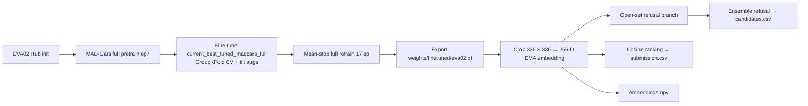
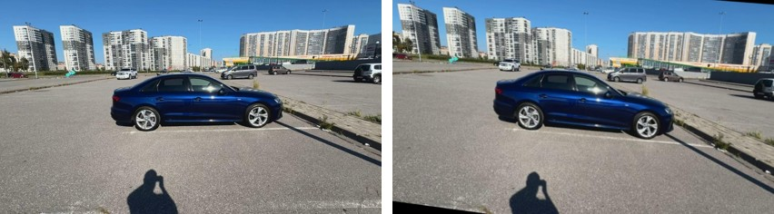
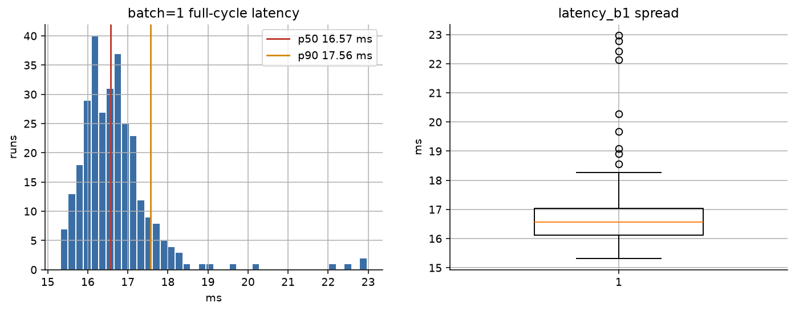
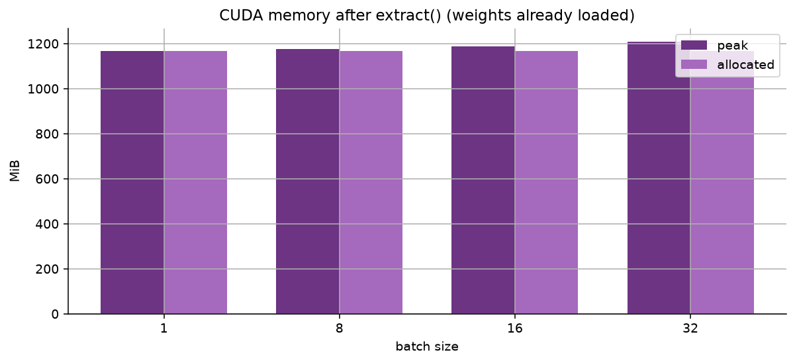
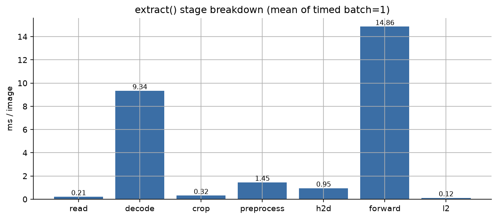
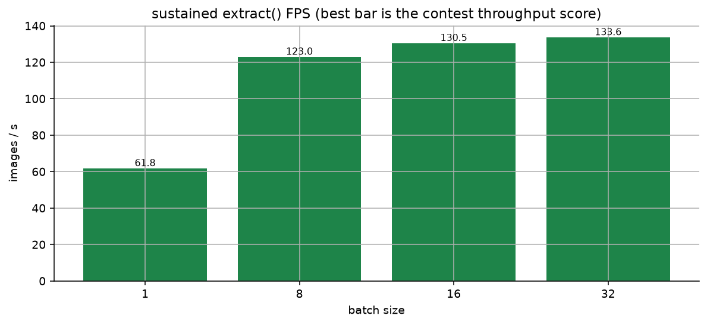
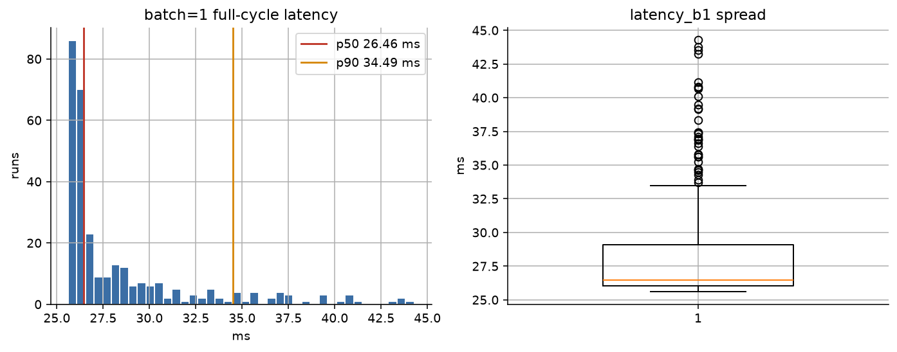

# Vehicle ReID Lab

## The solution in two minutes

This is an open-set vehicle re-identification task: rank the gallery for each query and decide
whether the same vehicle is present. `submission.csv` contains the top 10 matches for **every**
query; `candidates.csv` records the accept/refuse decisions. `embeddings.npy` contains query
embeddings followed by gallery embeddings in input CSV order. The output format and evaluation
protocol follow the [task specification](info/task.pdf) and the written
[expert answers](info/expert_answers.xlsx).



Serving content comes from `runs/cv/madcars_full_ft_ep35` / `runs/full/madcars_full_ft_ep35`,
initialized from MAD-Cars full pretrain epoch 7. File names stay
`weights/finetuned/eva02.pt` and `eva02_catboost.cbm` (Docker and tests keep those names).

Primary pipeline:

1. **EVA02 Hub init** — public LLM2CLIP/EVA02-L-14-336 snapshot.
2. **MAD-Cars full pretrain (ep7)** — identity-labeled MAD-Cars crops with view-from-above tilt
   augs (`configs/augmentation/reid_tilt.yaml`); checkpoint under
   `runs/pretrain/madcars_full_pretrain_ep7/`.
3. **Fine-tune on competition data** —
   [`current_best_tuned_madcars_full`](configs/experiment/current_best_tuned_madcars_full.yaml):
   PK 16×4 camera-diverse + tilt augs, Optuna-tuned knobs, ArcFace + AdaSP, EMA. Five GroupKFold
   splits are identity-disjoint by `vehicle_id` (`runs/cv/madcars_full_ft_ep35`).
4. **Mean-stop full retrain** — rounded mean of fold best-stop epochs → **17 epochs** on all
   labeled identities (`runs/full/madcars_full_ft_ep35`).
5. **Open-set refusal** — nested identity-disjoint OOF on `madcars_full_ft_ep35`: cosine cut
   0.5854 (contest 0.857), CatBoost 0.4034 (contest 0.862), ensemble (AND) contest **0.863**.
   Docker default is `refusal=eva02_ensemble`.

| Measurement | Result | Interpretation |
| --- | ---: | --- |
| Retrieval, five-fold OOF | **mAP@10 0.892**, mAP 0.900, Rank-1 0.902 | Local identity-disjoint estimate from `runs/cv/madcars_full_ft_ep35` (`cv_metrics.json`). Not a locked test score. |
| Refusal, nested contest | **0.863** ensemble (cosine 0.857 / CatBoost 0.862) | Nested `0.7 × F1 + 0.3 × TNR` on `madcars_full_ft_ep35` packs; Docker uses `refusal=eva02_ensemble` (cuts 0.5854 / 0.4034). |
| H200, same architecture | **16.6 ms** batch-1 `extract()`; **532 images/s** at batch 32 | Earlier checkpoint; isolated measurement with first-forward compilation reported separately. |
| RTX A5000, same architecture | **26.5 ms** batch 1; **133.6 images/s** at batch 32 | Historical measurement with earlier weights; indicative speed for the current weights. CPU and driver differ from the organizers' machine. |
| RTX 3090, same architecture | **23.7 ms / 119.9 images/s** with compile; **40.5 ms / 73.3 images/s** without | Earlier checkpoint on Vast driver 535.113.01 (advertised CUDA 12.2); see the full profile and compatibility replay below. |

The final Docker image serves the MAD-Cars-pretrained full retrain, its 256-D embeddings, cosine
ranking, and the cosine∧CatBoost ensemble refusal rule. Research experiments are separated from
the submitted inference path:

| Status | Components |
| --- | --- |
| Used in serving | MAD-Cars ep7 init → full-retrain EVA02/EMA (`madcars_full_ft_ep35`), crop with context, BNNeck, top-10 cosine ranking, and ensemble refusal (`eva02_ensemble`); TTA and retrieval postprocessing are disabled. |
| Evaluated as experiments | Labeled-only EVA02 K=4+cam (no MAD-Cars), HDBSCAN test pseudo-labels, stronger augmentations, other losses and backbones, EfficientLoFTR, alternative refusal heads, and TensorRT. |
| Not in the final pipeline | Additional VeRi/VRIC data, test pseudo-labels, query expansion/AQE, graph reranking, EfficientLoFTR, and a TensorRT engine. |

After building the image (`docker compose build`), one command from the repository root writes
all three output files to `runs/submission/`:

```bash
DATA_ROOT=./data OUTPUT_DIR=./runs/submission docker compose run --rm retrieval
```

See the [dataset layout](#dataset-layout) for inputs and [Contest Docker](#contest-docker-image)
for image settings and the equivalent `docker run`. Visual checks:
[per-fold metrics](notebooks/eva02/readme_figs/current_best_folds.png),
[query/gallery pairs](notebooks/eva02/readme_figs/current_best_pairs.jpg),
[refusal results](notebooks/eva02/readme_figs/refusal_bars.jpg), and
[H200 latency](notebooks/eva02/readme_figs/inference_latency.png).
The rest of this README documents the full configurations, protocol constraints, experiments,
and reproduction steps.

## Contest Docker image

The image may use the network during `docker build`. `docker run` is fully offline:
`HF_HUB_OFFLINE=1`, `TRANSFORMERS_OFFLINE=1`, and Compose `network_mode: none`. GPU access is
`--gpus all` (Compose `gpus: all`). Python packages are
installed from `requirements/runtime.txt` with `pip install --require-hashes` on public PyPI.
That file pins the inference environment; regenerate it with `make lock` when dependency pins
change. The lab `uv.lock` registry URL is not used at image build time.

The serving `.pt` and `eva02_catboost.cbm` are copied into the image from `weights/finetuned/`. Do not mount a host
`weights/` directory over `/app/weights`, or the baked files are hidden. Mount only contest data and
the output directory:

```bash
docker compose build
DATA_ROOT=./data OUTPUT_DIR=./runs/submission docker compose run --rm retrieval
```

Equivalent:

```bash
docker run --gpus all --network none \
  -v "$PWD/data:/data:ro" \
  -v "$PWD/runs/submission:/runs/submission" \
  retrieval
```

One command writes `submission.csv`, `embeddings.npy`, and `candidates.csv` from the mounted
`images/` plus query/gallery CSV. The default command is:

```text
checkpoint=/app/weights/finetuned/eva02.pt
data.root=/data
eval.split=test
eval.output_dir=/runs/submission
eval.top_k=10
refusal=eva02_ensemble
```

Override `CHECKPOINT` or pass extra Hydra flags after `retrieval`. Eval loads
`ReIDModel(..., initialize_pretrained=False)`, so Hub/timm pretrained weights are not fetched at
inference. SDPA + `torch.compile` are enabled for llm2clip even when the Hydra default model is
ConvNeXt: kernel flags overlay only if `model.backend` matches the checkpoint. `torch.compile`
does most of its work on the first forward (~45 s on H200), not when the wrapper is created; later
batches use the compiled graph. Cold start still counts toward the overall run budget.
The image is CUDA 12.8; organizers list a 12.2 driver — confirm that pairing by running, not by
version numbers alone.
`extra_data/`, tests, notebooks, and training runs are not copied into the image.

## Output files and validation protocol

The evaluation directory contains:

- `embeddings.npy`: contest embedding matrix for `eval.split=test`. Rows are `test_query.csv` in
  file order, then `test_gallery.csv` in file order, with no extra sort. Shape
  `(len(query)+len(gallery), D)`, `float32`. Vectors are L2-normalized after TTA; the official
  scorer also L2-normalizes, so that is optional on their side. `query_id` / `gallery_id` are
  `image_id`. Local `eval.split=val` writes the same file over the held-out fold table instead.
- `retrieval_embeddings.npy`: query and gallery embeddings after enabled expansion stages.
- `distances.npy`: final query-to-gallery distance matrix, when enabled.
- `submission.csv`: wide top-10 table `query_id,gallery_id_1,...,gallery_id_10`, **no header**. One row per query
  in CSV order, including open-set and refused queries. No `confidence` column. Empty cells and
  skipped queries are invalid here; refusal is not expressed in this file. The demo gallery has 8
  images, so its example file has 8 candidates plus the query ID (9 columns); a full gallery writes 10
  candidates plus the query ID (11 columns).
- `candidates.csv`: contest accept/refuse file. Columns `query_id,gallery_id,confidence` in that
  order, header required. `confidence` is a monotone similarity score (higher = more confident);
  the range need not be `[0, 1]`. Organizers rank by this value and take the **max-confidence**
  row per `query_id`. Extra rows below that top candidate do not affect F1 or TNR; there is no
  cap on row count. `refusal=` (`none` / `eva02_threshold` / `eva02_model` / `eva02_ensemble`)
  decides which queries are written. A refused query has **no rows**. Empty `gallery_id` and
  placeholder values are not written. Organizers do **not** apply a second threshold to
  `confidence`; including a `query_id` is the accept decision.
- `query.csv` and `gallery.csv`: exact evaluated row order.
- `embedding_order.csv`: sidecar `image_id` list for `embeddings.npy` (not required by the scorer).
- `metrics.json`: run metadata and validation metrics when labels are available.
- `config.yaml`: resolved evaluation configuration.

Validation reports full-gallery mAP (checkpoint selection and Optuna), official mAP@10 over the
submission top-10, mINP, and configured CMC ranks. After junk filtering (same-camera **and**
same-identity gallery images), queries with no remaining valid positive are **excluded from the
mAP@10 / Rank-1 / Rank-5 average**, not scored as AP=0. Gallery images of a *different* identity
on the query camera stay in the ranking. That includes unmarked open-set queries (~20% of the
closed test) and any query whose only gallery positive was junk. Those queries are scored only
through `candidates.csv` (F1, TNR), where the correct output is a refusal (no row). Evaluation
fails if no query has a valid positive.

The saved val galleries already drop same-camera same-identity images before ranking, so the
published OOF never sees that junk (`n_same_cam_id=0`). The numbers below were measured on the
27-epoch K=4 camera-diverse labeled-only run (`runs/cv/eva02_k4_cam`, OOF mAP@10 0.847 /
Rank-1 0.844), not recomputed on the later labeled-only 35-epoch OOF (0.851 / 0.848) or the
serving MAD-Cars fine-tune OOF (`runs/cv/madcars_full_ft_ep35`, 0.892 / 0.902); the protocol gap
is the same.
Putting those images back from each fold's `oof.csv` (about 1.6 per query; 1403 of 1541 queries
have at least one) and scoring each query's gallery two ways: filter-then-top-10, as in
`modules/metrics.py`, stays at mAP@10 0.847 and Rank-1 0.844; write the raw top-10 and only then
strip junk inside those ten, as `eval.py` plus `data/evaluate.py` do, falls to mAP@10 0.843 with
Rank-1 unchanged. Junk sits in the raw top-10 of 1396 queries. On 64 queries a positive is inside
the filtered top-10 and missing from the truncated submission. Test CSVs do not carry `camera_id`
or `vehicle_id`, so serving cannot backfill those ranks. This is a gap between the H7 clarification
and the reference file format, measured by reinserting junk into OOF, not a proven loss on the
hidden test.

## Technical documentation

Vehicle ReID Lab is an experimental open-set vehicle re-identification and image-retrieval pipeline
built with PyTorch, Lightning, and Hydra. It trains an embedding model, evaluates it on
identity-disjoint validation folds, and produces ranked gallery matches for query images.

The project is designed for controlled backbone, loss, augmentation, regularization, and retrieval
experiments. Configuration is explicit, fold manifests are reproducible, and checkpoints are tied
to the dataset and label mapping that produced them.

## Repository capabilities

The following list describes supported tools and experiments; the submitted path is specified in
[The solution in two minutes](#the-solution-in-two-minutes).

- Backbone adapters for timm, Hugging Face Transformers, NVIDIA RADIO, and LLM2CLIP/EVA.
- Single-level and multi-level convolutional features.
- GAP, GeM, signed GeM, max, average-max, attention, and CLS pooling.
- ArcFace, CosFace, SphereFace2, triplet, AdaSP, and pytorch-metric-learning losses.
- P × K identity sampling with optional camera-diverse instance selection.
- Backbone freezing, layer-wise learning-rate decay, R-Drop, AWP, and EMA.
- Test-time augmentation over flips, rotations, scales, and bounding-box context of a single image.
- Streaming retrieval postproc: gallery-side aggregation and per-query rerank. AQE is OOF-only.
- Open-set refusal: cosine threshold, CatBoost, and TabM on retrieval-set features.
- EfficientLoFTR pair matching as a retrieval visualizer and top-k verifier.
- Iterative test pseudo-labeling: embed query+gallery, HDBSCAN identities, fine-tune on labeled train plus clusters.
- Reproducible GroupKFold splits with no vehicle identity overlap between train and validation.
- CPU/offline test suite with 100% line coverage for first-party Python code.
- Contest serving files are the EMA `.pt` and the CatBoost `.cbm` used for open-set refusal.
- Serving inference uses fused SDPA, `torch.compile`, and the same DataLoader decode path as Docker. Isolated H200 `extract()` latency is 16.6 ms; DataLoader throughput peaks at 532 FPS.

## Contents

- [Contest Docker](#contest-docker-image) · [Output files and validation protocol](#output-files-and-validation-protocol)
- [Requirements](#requirements) · [Installation](#installation) · [Dataset layout](#dataset-layout)
- [Data validation and folds](#data-validation-and-folds) · [Configuration](#configuration)
- [Backbones](#backbones) · [Losses and sampling](#losses-and-sampling) · [Augmentation](#augmentation)
- [Pretraining](#pretraining) · [Training](#training) · [Evaluation and retrieval](#evaluation-and-retrieval)
- [Open-set refusal](#open-set-refusal) · [Export and offline serving weights](#export-and-offline-serving-weights)
- [Cross-validation](#cross-validation) · [HPO](#hyperparameter-optimization) · [Quality gates](#quality-gates)
- [Research and optional methods](#research-and-optional-methods) · [Metric board](#metric-board)


## Requirements

- Linux is recommended.
- Python 3.11 or 3.12.
- `uv` or Python/pip for local development; Docker serving needs neither on the host.
- Git LFS for `weights/finetuned/` serving checkpoints.
- A CUDA-compatible GPU for training and large-backbone smoke tests.
- Sufficient storage for datasets, checkpoints, and pretrained weights.

The default development tests do not require a GPU, network access, or production data.

## Installation

Contest serving requires only Docker on the host. The image installs the hashed
`requirements/runtime.txt` with pip; it does not run `uv sync` or read `uv.lock` at build time.

For local development, create an environment and install runtime, development, and notebook
dependencies with either method. The `uv` path uses `uv.lock`:

```bash
uv sync --extra dev
```

The equivalent Make target is:

```bash
make setup
```

To install from `pyproject.toml` without `uv.lock`:

```bash
python3 -m venv .venv
.venv/bin/python -m pip install -e '.[dev]'
```

The pip command uses the pinned direct dependencies in `pyproject.toml` but does not lock their
transitive versions as `uv.lock` does.

After changing dependencies, refresh the lock and the hashed Docker freeze:

```bash
make lock
```

Commands in this README use executables from `.venv`. If the environment is activated, the
`.venv/bin/` prefix can be omitted.

## Dataset layout

Docker Compose mounts the repository's `data/` directory at `/data` and expects:

```text
data/
├── train.csv
├── test_query.csv
├── test_gallery.csv
└── images/
    ├── image_000001.jpg
    ├── image_000002.jpg
    └── ...
```

The checked-in Hydra [configuration](configs/config.yaml) has a stage-machine absolute
`data.root` default. For direct local `train.py` and `eval.py` commands, pass
`data.root="$PWD/data"` (or another absolute path); Docker sets `data.root=/data`.

Exploratory plots of the competition CSVs and crops:
[eda.ipynb](notebooks/eda.ipynb). Paths can be changed in
[`configs/config.yaml`](configs/config.yaml) or through Hydra overrides:

```bash
.venv/bin/python train.py \
  data.root=/datasets/vehicle-reid \
  data.train_csv=/datasets/vehicle-reid/train.csv \
  data.image_dir=/datasets/vehicle-reid/images
```

### Annotation schema

Every annotation CSV must contain:

- `image_id`: image filename or identifier.
- `x`, `y`: top-left corner of the vehicle bounding box.
- `w`, `h`: positive bounding-box width and height.

`train.csv` must also contain:

- `vehicle_id`: identity used for supervised training and fold construction.

For cross-camera validation, provide:

- `camera_id`: camera identifier. If omitted, it is set to `-1`; cross-camera metrics cannot be
  computed with unknown camera IDs.

Example training rows:

```csv
image_id,vehicle_id,camera_id,x,y,w,h
000001,42,0,31,18,224,136
000002,42,1,12,25,230,140
000003,84,0,48,20,198,132
```

Query and gallery CSV files use the same image and bounding-box fields. Ground-truth
`vehicle_id` values are not required for test retrieval.

If `image_id` has no extension, the loader searches for `.jpg`, `.png`, and `.jpeg`, in that order.
Bounding boxes are clipped to the image boundary. Invalid, empty, non-finite, or duplicated
annotations are rejected instead of being silently corrected.

## Data validation and folds

Audit CSV files, image paths, image readability, and bounding boxes:

```bash
make audit
```

The direct command is:

```bash
.venv/bin/python scripts/audit_data.py --root data --check-images
```

Create persisted identity-disjoint folds:

```bash
make folds
```

Fold construction uses shuffled `GroupKFold` with `vehicle_id` as the group. The generated CSV and
JSON metadata contain the split, data fingerprint, seed, fold count, and protocol version.
Existing manifests are validated before reuse. A stale manifest, changed annotation file, invalid
fold index, or identity leakage causes an error.

Validation query/gallery construction is deterministic. For cross-camera evaluation, a query is
selected from one camera and positive gallery images are taken from other cameras. Identities
without a valid cross-camera positive remain gallery distractors.

## Configuration

The root Hydra configuration is `configs/config.yaml`. Components can be selected independently:

```text
configs/
├── augmentation/
├── experiment/
├── loss/
├── model/
├── optimizer/
├── refusal/
└── scheduler/
```

Example composition:

```bash
.venv/bin/python train.py \
  model=resnet50 \
  loss=arcface \
  optimizer=adamw \
  scheduler=cosine \
  data.fold=0
```

Common command-line overrides:

```bash
.venv/bin/python train.py \
  model.head.embedding_dim=768 \
  model.pooling.kind=gem \
  data.image_size='[320,320]' \
  data.sampler.identities=16 \
  data.sampler.instances=4 \
  train.epochs=30 \
  trainer.devices=1
```

Important configuration sections:

- `data`: file paths, image preprocessing, folds, loaders, sampling, and validation protocol.
- `model`: backend, architecture, checkpoint, feature layout, pooling, and embedding head.
- `loss`: one or more weighted classification or metric-learning objectives.
- `optimizer` and `scheduler`: optimizer construction, warmup, and learning-rate schedule.
- `augmentation`: ordered Albumentations and torchvision operations.
- `train`: gradient accumulation, clipping, freezing, R-Drop, AWP, EMA, and layer decay.
- `trainer`: Lightning accelerator, devices, precision, strategy, and batch limits.
- `eval`: checkpoint weights, split, device, precision, TTA, output directory, and top-K.
- `postproc`: gallery aggregation, per-query reranking, dense-memory budget. AQE is not used at serve.

## Backbones

Available model presets include:

- `convnext_tiny`
- `resnet50`
- `swin`
- `vit`
- `dinov3_convnext_base`
- `dinov3_convnext_large`
- `dinov3_convnext_multilevel`
- `radio`
- `llm2clip`

To test backbone construction and gradients on CUDA:

```bash
.venv/bin/python scripts/check_backbone.py convnext_tiny vit --backward
```

## Losses and sampling

Loss presets are located in [`configs/loss/`](configs/loss/). Hydra's root default without an
experiment (`loss: combined`) is ArcFace on the BN-neck plus hard-mined triplet on the raw
embedding. **Serving is different:**
[`current_best_tuned_madcars_full`](configs/experiment/current_best_tuned_madcars_full.yaml)
uses ArcFace+AdaSP on the neck (`embedding_dim=256`), not triplet.

AdaSP requires a P × K sampler with at least two identities and two instances per identity. The
sampler emits contiguous identity groups and can prefer samples from different cameras.

The loss registry rejects unknown objectives, invalid mining modes, non-finite loss values, and
configurations with no positive loss weight.

## Augmentation

`configs/augmentation/reid.yaml` defines the training pipeline. It includes geometric,
photometric, compression, blur, noise, weather, occlusion, erasing, and policy-based transforms.
Each transform has an independent `enabled` switch and probability.

The pipeline does not mix identities. Random state is reseeded per data-loader worker. Misspelled
or unsupported Albumentations arguments are treated as errors.

Image resizing supports:

- `pad`: preserve aspect ratio and pad to the configured canvas.
- `stretch`: resize directly to the configured width and height.

## Pretraining

### Public backbone weights

Download supported external weights on a machine with Hugging Face access:

```bash
.venv/bin/python scripts/download_weights.py dinov3_base
.venv/bin/python scripts/download_weights.py dinov3_large
.venv/bin/python scripts/download_weights.py radio
.venv/bin/python scripts/download_weights.py llm2clip
.venv/bin/python scripts/download_weights.py efficientloftr
```

Copy the resulting `weights/` directory to the training machine and set the corresponding
`model.checkpoint_path`. Use `model.local_files_only=true` where supported to prevent network
access. Each download is pinned by file SHA-256 (and a Hub commit for RADIO and LLM2CLIP). A
checksum mismatch after download is an error.

### External pretraining data

External identity-labeled datasets live under `extra_data/`. MAD-Cars is used in the submitted
training path; VeRi and VRIC are supported alternatives. The loaders expect:

```text
extra_data/
├── VeRi/
│   ├── image_train/
│   └── train_label.xml
├── VRIC/
│   ├── train_images/
│   └── vric_train.txt
└── madcars/
    ├── images/<car_id>/<view_id>.jpg
    ├── meta/mad.csv
    └── meta/subsample20.csv
```

VeRi uses `image_train/` plus `train_label.xml`. Source:
[VeRi-776 on Kaggle](https://www.kaggle.com/datasets/abhyudaya12/veri-vehicle-re-identification-dataset)
([CC BY-NC 4.0](https://creativecommons.org/licenses/by-nc/4.0/)).

VRIC uses `train_images/` plus `vric_train.txt` lines of `image identity camera`. Source:
[VRIC](https://qmul-vric.github.io/). The images are derived from [UA-DETRAC](https://detrac-db.rit.albany.edu/).

MAD-Cars uses `images/<car_id>/<view_id>.jpg` plus a `meta/*.csv` with `car_id,view_id` rows.
Source: [yandex/mad-cars on Hugging Face](https://huggingface.co/datasets/yandex/mad-cars)
(introduced by [MADrive](https://arxiv.org/abs/2506.21520),
[CC BY-NC-SA 4.0](https://creativecommons.org/licenses/by-nc-sa/4.0/)). It is a large-scale
collection of ~70k car instances with ~85 views each at up to 1920×1080; we use a working subsample
(~1.4M images, 20 views per car) downloaded with `scripts/download_madcars.py` and listed in
`extra_data/madcars/meta/subsample20.csv`. Views are shot handheld at ground level, so pretraining
uses a view-from-above tilt augmentation (`configs/augmentation/reid_tilt.yaml`) to bridge the
domain shift to the competition cameras (see below).

The three datasets are public research sources; check each source's license before reuse.
VeRi is CC BY-NC 4.0 and MAD-Cars is CC BY-NC-SA 4.0.
That matches the task statement: public
pretrained weights and third-party open datasets are allowed and encouraged, while closed,
proprietary, or unreproducible data are not. List these sources in the solution README when a
pretrained checkpoint is submitted. Do not copy `extra_data/` into the submission; keep the
datasets reproducible from the original downloads.

VeRi and VRIC images are already cropped, so pretraining does not apply competition bounding boxes.
MAD-Cars instances are full frames with the car as the subject, which `full_image: True` handles.
For MAD-Cars pretraining, `view_id` is a proxy used by camera-diverse sampling; fine-tuning uses
the competition's actual `camera_id`.

#### View-from-above tilt augmentation

MAD-Cars views are handheld at ground level, while competition cameras look at vehicles slightly
from above. Pretraining with `configs/augmentation/reid_tilt.yaml` simulates that viewpoint with an
`Affine` shear (`y=[-12,-4]`, `p=0.3`) plus a light `Perspective` (`p=0.15`) on top of the tuned
`current_best_tuned` transforms:



Screening on a 20k-car × 10-view MAD-Cars subsample (3-fold OOF, otherwise identical recipe) shows
the tilt is worth about +1.2 mAP points on the CV pass after pretraining:

| MAD-Cars 20k pretrain | mAP | mAP@10 | Rank-1 |
| --- | ---: | ---: | ---: |
| without tilt (`madcars_default`) | 0.8658 | 0.8562 | 0.8627 |
| with tilt (`madcars_tilt`) | **0.8774** | **0.8683** | **0.8757** |

The full-data run uses the tilt recipe on ~1.4M images; its checkpoint-by-checkpoint 5-fold OOF is
in the metric board below.

### MAD-Cars pretraining

`pretrain.py` trains on 100% of one or more extra datasets and validates against 100% of the
competition `train.csv` query/gallery split. Use this to produce a backbone/head checkpoint that
can initialize ordinary competition training.

The full MAD-Cars pretrain needs the public `mad.csv` URL manifest first. The image downloader
does **not** download that manifest. Fetch it, then select and download the 20-view subset used
by the `madcars_full` reader:

```bash
mkdir -p extra_data/madcars/meta
.venv/bin/hf download yandex/mad-cars mad.csv --repo-type dataset \
  --revision 3fa6f91824d0164029908d7953a1b0483adc38ba \
  --local-dir extra_data/madcars/meta
.venv/bin/python scripts/download_madcars.py \
  --cars 0 --views 20 --min-views 4 \
  --dataset madcars --subsample-name subsample20.csv
```

`--cars 0` selects every eligible car; interrupted downloads can be rerun against the same
subsample CSV. The pretrain launcher `scripts/run_madcars_full_pretrain.sh` downloads nothing and
expects the resulting `extra_data/madcars/` tree. It uses
[`current_best_tuned_madcars_full`](configs/experiment/current_best_tuned_madcars_full.yaml)
(LLM2CLIP with `reid_tilt`) and the `madcars_full` reader backed by
`meta/subsample20.csv`. The script uses the same model/head architecture as the later fine-tune
and retains the completed epoch-7 checkpoint as `milestone_epoch007.ckpt`, independently of the
two best monitored checkpoints. Export that EMA state for every competition fold and the full
retrain (set `PRETRAIN_RUN` to the timestamped output directory of the run you intend to use):

```bash
PRETRAIN_RUN=$(ls -dt runs/pretrain/madcars_full/*/ | head -1)
.venv/bin/python scripts/export_serving.py \
  --checkpoint "${PRETRAIN_RUN%/}/checkpoints/milestone_epoch007.ckpt" \
  --output runs/pretrain/madcars_full_pretrain_ep7/checkpoints/madcars_full_pretrain_ep7.pt \
  --weights ema
```

### VeRi, VRIC, and SSL alternatives

Train on VeRi, VRIC, MAD-Cars, or a combination. `scripts/pretrain.sh` selects the GPU, Hydra model group, extra
datasets, and experiment recipe. It defaults to `experiment=current_best_tuned` and local
`weights/` checkpoints:

```bash
scripts/pretrain.sh cuda:2 dinov3_convnext_base veri
scripts/pretrain.sh cuda:2 llm2clip vric
scripts/pretrain.sh 2 dinov3_convnext_base veri,vric
scripts/pretrain.sh cuda:2 radio both smoke
scripts/pretrain.sh cuda:2 llm2clip test_train_ssl_crop
scripts/pretrain.sh cuda:2 llm2clip test_train_ssl_full
```

The first argument is `cuda:N` or `N`. The second is the Hydra model group. The third is `veri`,
`vric`, `veri,vric`, `both`, `test_train_ssl_crop`, or `test_train_ssl_full` (`test_train_ssl` is a
crop alias). An optional fourth token without `=` is the experiment name; otherwise extra tokens are
Hydra overrides. LLM2CLIP is forced to 336 × 336 and `local_parts=0`. SSL replaces the experiment
loss with DINOv3-style DINO/iBOT/KoLeo/Gram and sets `data.sampler.kind=random`. Set
`EXPERIMENT`, `MODEL_CHECKPOINT`, `NAME`, or `PYTHON` to override the defaults.

Direct Hydra remains available:

```bash
.venv/bin/python pretrain.py experiment=current_best_tuned model=llm2clip pretrain.datasets=[veri]
.venv/bin/python pretrain.py experiment=current_best_tuned model=llm2clip pretrain.datasets=[vric]
.venv/bin/python pretrain.py experiment=current_best_tuned model=llm2clip \
  pretrain.datasets=[test_train_ssl_crop]
.venv/bin/python pretrain.py experiment=current_best_tuned model=llm2clip \
  pretrain.datasets=[test_train_ssl_full]
.venv/bin/python pretrain.py experiment=current_best_tuned_madcars_full model=llm2clip \
  pretrain.datasets=[madcars_full] name=madcars_full
```

The default config mixes VeRi and VRIC. Identity and camera IDs are remapped so mixed sources do
not collide. Outputs include the usual Lightning checkpoints plus `run_summary.json` with dataset
names, image counts, and checkpoint paths.

Initialize a competition fold from the pretrain checkpoint. Keep the model, pooling, and embedding
head the same. Do not use `resume` for this transfer: pretraining uses a different identity space
and data fingerprint, so `train.py` would reject that checkpoint.

```bash
.venv/bin/python train.py \
  experiment=current_best_tuned \
  init_checkpoint=runs/pretrain/llm2clip_veri/<run>/checkpoints/<ckpt>.ckpt \
  data.fold=0
```

`init_checkpoint` loads `model.*` weights only. A serving `.pt` (`format=reid-serving`) is accepted;
EMA shadows from a Lightning checkpoint are used when `validation_weights=ema`. Losses and classifiers
are created for the competition identity count, so the DINO prototype head is not transferred.
`mask_token` may be absent from a non-SSL serving payload. `resume` and `init_checkpoint` cannot be
set together.

## Training

Run the small smoke configuration:

```bash
make smoke
```

Run a standard fold:

```bash
.venv/bin/python train.py model=convnext_tiny data.fold=0 trainer.devices=1
```

Experiment presets provide larger ready-to-run configurations:

```bash
.venv/bin/python train.py experiment=dino_base data.fold=0
.venv/bin/python train.py experiment=radio data.fold=0
.venv/bin/python train.py experiment=llm2clip data.fold=0
.venv/bin/python train.py experiment=current_best_tuned_madcars_full \
  init_checkpoint=runs/pretrain/madcars_full_pretrain_ep7/checkpoints/madcars_full_pretrain_ep7.pt \
  data.fold=0
```

### Serving recipe (MAD-Cars pretrain → fine-tune)

Serving initializes from **MAD-Cars full pretrain epoch 7**, then fine-tunes on competition
`train.csv` with
[`current_best_tuned_madcars_full`](configs/experiment/current_best_tuned_madcars_full.yaml):
the Optuna `convnext_base_all` trial 23 knobs on LLM2CLIP EVA02-L-14-336, PK 16×4 with
camera-diverse sampling, **tilt** augmentations (`reid_tilt`), ArcFace+AdaSP
(`embedding_dim=256`), linear schedule, EMA. Identity-disjoint 5-fold OOF
(`runs/cv/madcars_full_ft_ep35`): mAP **0.900**, mAP@10 **0.892**, Rank-1 **0.902**
(`cv_metrics.json`). Mean best-stop full retrain uses **17** epochs.

MAD-Cars pretrain is part of the submitted path (not only a research appendix). Prepare MAD-Cars
with the metadata and image commands in [Pretraining](#pretraining), then run
`scripts/run_madcars_full_pretrain.sh` using
`experiment=current_best_tuned_madcars_full` and `madcars_full`
(`extra_data/madcars/meta/subsample20.csv`). Views are handheld at ground level; tilt
(`Affine` shear + light `Perspective`) bridges to competition cameras. Screening on a 20k-car
subsample showed about +1.2 mAP after pretrain with tilt vs without. Export the ep7 EMA
checkpoint to `runs/pretrain/madcars_full_pretrain_ep7/checkpoints/madcars_full_pretrain_ep7.pt`
and pass it as `init_checkpoint` for every fold and for the full retrain. Details and VeRi/VRIC/SSL
variants stay under [Research and optional methods](#research-and-optional-methods).

The labeled-only baseline without MAD-Cars
([`current_best_tuned`](configs/experiment/current_best_tuned.yaml) /
[`eva02_k4_cam_ep35`](configs/experiment/eva02_k4_cam_ep35.yaml), `runs/cv/eva02_k4_cam_ep35`)
scores mAP 0.862 / mAP@10 0.851 / Rank-1 0.848 (35-epoch budget; mean-stop full retrain was 32).
That run is **not** the serving checkpoint. Isolated H200 contest `extract()` latency on the
serving architecture is 16.6 ms
([profile notebook](notebooks/eva02/inference_profile.ipynb)); DataLoader throughput peaks at
532 FPS (batch 32). HDBSCAN test pseudo-labels were tried and are **not used**.


*Identity-disjoint 5-fold OOF on the serving recipe (`runs/cv/madcars_full_ft_ep35`).
Query-weighted means: mAP 0.900, mAP@10 0.892, Rank-1 0.902. Checkpoint selection and Optuna used
full-gallery mAP; mAP@10 on `submission.csv` is the contest ranking metric.
GroupKFold stays. OOF is fold extractors; serving `eva02.pt` is the MAD-Cars-init full retrain
on every labeled identity.*


*Fold-0 query / Rank-1 gallery crops from the serving OOF. Notebook:
[oof_analysis.ipynb](notebooks/eva02/oof_analysis.ipynb).*


*Difficulty slices on the serving OOF. Notebook:
[oof_analysis.ipynb](notebooks/eva02/oof_analysis.ipynb).*

### Full retrain

`data.full_retrain=true` trains on every competition identity (all five fold groups). There is no
held-out val split and no `val/mAP` checkpoint monitor: Lightning saves `last.ckpt` after a fixed
epoch budget. `eval.split=val` refuses that checkpoint, because train IDs cover the held-out fold.

Set the budget to the rounded mean of the five best-checkpoint **completed** epoch counts from an
identity-disjoint CV run. Lightning filenames are 0-based (`epoch025.ckpt` means 26 completed
epochs). For serving `runs/cv/madcars_full_ft_ep35` that is
`(20+26+10+12+19)/5 = 17.4 → 17`, so `train.epochs=17` (epochs 0–16). Pass `data.cv_dir=` to
compute that mean inside `train.py`; otherwise keep `train.epochs` as in the experiment YAML.
Init from the MAD-Cars ep7 pretrain checkpoint, not from a previous serving full-retrain `.pt`
(that checkpoint has already seen every original identity) and not from the Hub snapshot alone.

```bash
.venv/bin/python train.py \
  experiment=current_best_tuned_madcars_full \
  data.full_retrain=true \
  data.cv_dir=runs/cv/madcars_full_ft_ep35 \
  init_checkpoint=runs/pretrain/madcars_full_pretrain_ep7/checkpoints/madcars_full_pretrain_ep7.pt \
  model.local_files_only=true \
  model.checkpoint_path=weights/llm2clip/LLM2CLIP-EVA02-L-14-336.pt \
  output_dir=runs/full/madcars_full_ft_ep35
```

Export the last EMA weights for contest serving. This is the default `scripts/export_serving.py`
source when `runs/full/madcars_full_ft_ep35/run_summary.json` exists:

```bash
.venv/bin/python scripts/export_serving.py \
  --checkpoint runs/full/madcars_full_ft_ep35/checkpoints/last.ckpt \
  --output weights/finetuned/eva02.pt \
  --weights ema \
  --sha256
```

Refit CatBoost in that same embedding space. `--nested` retunes cosine and CatBoost operating points
from identity-disjoint fold-OOF inner CV on **20% identity-hold-out** eval packs. For
`madcars_full_ft_ep35` the nested cuts are cosine **0.5854** and CatBoost **0.4034** (ensemble
contest 0.863; Docker `refusal=eva02_ensemble`). CatBoost still trains on 50/50 stripped-identity
pairs; F1/TNR and the contest operating point do not. `--full-retrain` re-embeds the five CV
query/gallery splits with the serving checkpoint (all identities, one model) and fits the same
200/4/0.08 recipe on every 50/50 pack. Full-retrain packs are in-sample and must not overwrite
those nested points. CLI rejects `--full-retrain --update-config` (that used to write a CatBoost
threshold fit on the same training packs). `eval.py` cannot build this pack: the full-retrain
checkpoint contains every identity, so `eval.split=val` is rejected.

```bash
.venv/bin/python scripts/export_refusal.py \
  --nested \
  --cv runs/cv/madcars_full_ft_ep35 \
  --update-config
.venv/bin/python scripts/export_refusal.py \
  --full-retrain \
  --cv runs/cv/madcars_full_ft_ep35 \
  --checkpoint runs/full/madcars_full_ft_ep35/checkpoints/last.ckpt \
  --device cuda:2 \
  --output weights/finetuned/eva02_catboost.cbm \
  --sha256
```

Omit `--full-retrain` to keep the 5-fold OOF CatBoost. Omit `--nested` to keep the frozen YAML
thresholds.

For multi-device training, the entrypoint selects a DDP strategy when `trainer.strategy=auto`.
Training uses manual optimization so gradient accumulation, AWP, scheduler updates, and EMA
updates happen in a defined order.

Outputs are written below `output_dir` and include:

- Resolved `config.yaml`.
- Persisted train/query/gallery split CSV files.
- `label_map.json`.
- Lightning logs.
- Last and monitored checkpoints.

### Resume safety

Resume training from a checkpoint:

```bash
.venv/bin/python train.py resume=/path/to/last.ckpt
```

The checkpoint is accepted only if its data fingerprint and label mapping match the current fold.
This prevents accidental continuation on different data or a different identity-to-class mapping.

## Evaluation and retrieval

Evaluate the validation split:

```bash
CHECKPOINT=$(.venv/bin/python -c \
  'import json, sys; print(json.load(open(sys.argv[1]))["best_checkpoint"])' \
  runs/cv/madcars_full_ft_ep35/fold0/run_summary.json)
.venv/bin/python eval.py \
  "checkpoint=$CHECKPOINT" \
  data.root="$PWD/data" \
  data.fold=0 \
  eval.split=val \
  eval.output_dir=runs/cv/madcars_full_ft_ep35/fold0/val
```

Use a best checkpoint from the matching fold's `run_summary.json`; the full-retrain
`weights/finetuned/eva02.pt` contains every train identity and is only for test inference.
The command requires the saved CV run and the same training data and fold assignment.

`eval.py` keeps model/data/augmentation from the checkpoint Hydra cfg, then applies the current H7
junk protocol (`data.validation.exclude_all_same_camera=false`) unless that key is an explicit CLI
override. llm2clip serving also turns on fused SDPA and `torch.compile` (`prepare_inference_model`)
unless `model.compile=false`. Older checkpoints stored `true` (drop every gallery crop on the query
camera). Eval no longer keeps that mask, so validation scores are not inflated relative to H7. To
reproduce the old filter: `data.validation.exclude_all_same_camera=true`.

Generate test query/gallery retrieval results:

```bash
.venv/bin/python eval.py \
  checkpoint=weights/finetuned/eva02.pt \
  eval.split=test
```

`eval.py`, `scripts/export_refusal.py --full-retrain`, and `scripts/pseudo_label.py` share
`embed_frame`: when `eval.tta.enabled` is true they extract every `eval.tta.context_pcts` crop and
average before L2. Scale/rotation/flip TTA still runs inside each crop via `embed_loader`.

Open-set refusal is applied only to contest `candidates.csv`. Serving heads and frozen thresholds
live in `configs/refusal/`. Default local `refusal=none` writes every query. The contest Docker
image defaults to `refusal=eva02_ensemble` (max cosine ≥ 0.5854 **and** CatBoost
`P(match exists)` ≥ 0.4034). The image installs CatBoost and copies
`weights/finetuned/eva02_catboost.cbm`. EVA02 serving presets drop refused queries: **no rows**
for that `query_id` (not an empty `gallery_id`, not a sentinel). `submission.csv` is ranking-only:
exactly `eval.top_k` (10) gallery IDs for **every** query, including open-set and refused ones, with
no score column and no skipped `query_id`.

```bash
.venv/bin/python eval.py checkpoint=weights/finetuned/eva02.pt eval.split=test refusal=eva02_ensemble
.venv/bin/python eval.py checkpoint=weights/finetuned/eva02.pt eval.split=test refusal=eva02_model
.venv/bin/python eval.py checkpoint=weights/finetuned/eva02.pt eval.split=test refusal=eva02_threshold
```

`eva02_ensemble` is the submit head (nested contest 0.863). `eva02_model` is CatBoost alone
(≥ 0.4034; nested contest 0.862). `eva02_threshold` is the cosine preset (≥ 0.5854; nested
contest 0.857). Model presets read `refusal.model_path`
(default `weights/finetuned/eva02_catboost.cbm`).
Export the head from OOF / full-retrain embeddings with `scripts/export_refusal.py`. Thresholds in
the YAMLs are frozen nested 5-fold inner-CV maxima of `0.7 × F1 + 0.3 × TNR` on 20%
identity-hold-out eval packs from `madcars_full_ft_ep35`, not retuned on the test set. TabM remains
a `refusal/` calibration head and is not a submit preset.

Select checkpoint weights with:

```bash
eval.weights=auto
eval.weights=raw
eval.weights=ema
```

`auto` uses the weight kind stored in the file (`validation_weights` on a Lightning `.ckpt`,
`weights` on a serving `.pt`). Requesting EMA weights from a checkpoint without EMA state is an
error. A serving `.pt` contains one exported set (usually EMA); asking for the other kind is an
error.

Evaluation preserves the original query and gallery CSV order. It refuses query/gallery image
overlap because no implicit self-match policy is assumed.

### Contest inference profile

Organizer timing is the full `extract()` cycle on one vehicle: disk read, decode, bbox crop,
preprocessing, forward, postprocessing, L2. Gallery search and re-ranking are excluded — they scale
with gallery size, not with the embedding model. `profiling/` reproduces that protocol with the
**same decode/crop/preprocess** as Docker (`dataset.images.load_record` / `VehicleDataset`).
`eval.py` embeds through `embed_frame` → `extract_frame` → a multiprocessing DataLoader.
Throughput in the notebook now uses that DataLoader, not a private ThreadPool. `profiling/` is still
not copied into the image; Docker already has `dataset/` and `modules/inference.py`. When
`eval.tta.enabled` is true, the timed `extract()` path averages the same views as `eval.py`:
scales, rotations, flips, and every `eval.tta.context_pcts` crop. The hardware tables below use
TTA off and earlier exports of the same embedding architecture.

- `latency_b1`: median of 300 timed batch-1 cycles after 50 warmups, with CUDA synchronize before
  and after every timed sample. This stays sequential `extract()` because that is the organizer
  one-vehicle cycle.
- `throughput`: sustained images/s at batch sizes 1 / 8 / 16 / 32. Each size keeps one
  DataLoader iterator yielding batches for at least 10 seconds, then that worker pool is
  released before the next size. The score counts images actually returned. Worker startup
  is `cold_start_s`, outside that window. Context TTA uses the same `embed_frame` average
  as Docker, including a repeated context. The score uses the best FPS.
- Also recorded: peak VRAM, weight-load time (reference), total weight-file bytes, two-run
  determinism. Stage bars are a separate diagnostic: they run after the same warmup as `latency_b1`,
  but each stage still synchronizes CUDA, so they must not be added up to explain the scored cycle.

Performance is 20% of the contest score: `10% × latency_score + 10% × throughput_score`.

| | Full score | Linear | Zero |
| --- | --- | --- | --- |
| Latency (batch=1, full cycle) | ≤ 40 ms | 40–80 ms | > 80 ms |
| Throughput (best FPS) | ≥ 100 | 50–100 | < 50 |

Weight files above 2 GiB are **not admitted** to this performance evaluation (no partial penalty).
The 2 GiB cap is the sum of every inference weight file in the solution directory with suffix
`.pt .pth .bin .onnx .engine .plan .safetensors .ckpt .trt .pb .tflite .npz`. Auxiliary CatBoost
`.cbm` files are reported by `profiling/` but are **not** in that official glob.

The run-time budget is about `latency_b1 × n_test × 3` (~4 minutes at the current closed-test
size). Organizers pass the image directory and CSV (`image_id, x, y, w, h`) as a batch; one
`docker run --gpus all` (or Compose equivalent) must write `submission.csv`, `embeddings.npy`, and
`candidates.csv`. Streaming independence (no query expansion, no use of other test queries) is
checked in source at the final review, not by the launch format.

[inference_profile.ipynb](notebooks/eva02/inference_profile.ipynb) charts stage costs, latency, FPS vs batch, VRAM, the
weight inventory against the 2 GiB cap, and these performance scores. Isolated H200 (`cuda:2`,
TTA off, bf16, earlier `eva02.pt`, torch 2.8.0+cu128 / CUDA 12.8, driver 575.57.08):

| Metric | Value |
| --- | --- |
| `latency_b1` | **16.6 ms** (p90 17.6 ms, p99 22.1 ms), sequential `extract()` |
| `throughput` | **532 FPS** at batch 32 on the DataLoader path (batch 1 / 8 / 16: 142 / 390 / 463 FPS) |
| Peak VRAM | 1.14 GiB @ b1 → **1.18 GiB @ b32** |
| Load | 4.6 s wrap; compile graph is paid on first forward, then excluded from timed extract |
| Serving `eva02.pt` | **~1.14 GiB** (under the 2 GiB cap) |
| Determinism | bit-identical on two compiled extracts within one process |
| Calculated performance under published thresholds | latency_score **1.0**, throughput_score **1.0**, performance_score **0.20**; not an awarded score |







*Contest `extract()` profile on isolated H200 for the earlier EVA02 export. Notebook:
[inference_profile.ipynb](notebooks/eva02/inference_profile.ipynb).*

Additional RTX A5000 profile: [executed notebook](notebooks/eva02/inference_profile_a5000.ipynb)
and [raw report](notebooks/eva02/inference_profile_a5000_figs/report.json). The profiling code
starts from Git commit `ebecee1` and runs with `eval.fast_kernels=false`, using an earlier
`eva02.pt` checkpoint of the same architecture, fold-0 query protocol, bf16 and TTA
off. One Vast.ai run used an RTX A5000 (24 GiB), driver 580.178.04, torch 2.8.0+cu128 / CUDA
12.8, and an i9-10900X host with a 4.8-core CPU quota. The Vast container and host are different
from the organizers’ environment. The A5000 numbers are an indicative speed comparison for the
current model, not a byte-for-byte test of the current checkpoint; a TensorRT engine built from
those earlier weights must be rebuilt for the current checkpoint.

| Metric | RTX A5000 |
| --- | --- |
| `latency_b1` | **26.5 ms** median (p90 34.5, p99 43.3 ms), 50 warmups + 300 full `extract()` cycles |
| `throughput` | **133.6 FPS** at batch 32; batch 1 / 8 / 16: 61.8 / 123.0 / 130.5 FPS, ≥10 s per batch |
| Peak VRAM | **1.18 GiB** @ b32 |
| Load | 6.3 s wrap; first-forward compile excluded from the timed cycles |
| Serving `eva02.pt` | **1.14 GiB**, below the 2 GiB cap |
| Determinism | bit-identical on two compiled extracts within one process |
| Calculated performance | latency_score **1.0**, throughput_score **1.0**, performance_score **0.20/0.20** |

Against the isolated H200 run above, median batch-1 latency is 1.64× and best throughput is
5.19× lower. This is a whole-system comparison: GPU, CPU quota, driver, base image, and the
`fast_kernels` setting differ. The prior A5000 [fast-kernel report](notebooks/eva02/inference_profile_a5000_figs/report_fast_kernels.json)
measured 26.6 ms and 134.2 FPS; the difference on this one host is small. The synchronized stage
diagnostic measured decode **9.3 ms** and forward **14.9 ms** on A5000;
stage times do not add to end-to-end latency. The calculated score is not an official submission
result.








Full serving entrypoint replay on the same A5000 used the **1,110 test queries and 750 test
gallery images**, the Dockerfile's `/app` file list, both verified weight files, pinned runtime
requirements, offline environment variables, and the Docker `CMD` arguments. This Vast instance is
an unprivileged container without Docker-in-Docker, so this tests the serving code and package
contents, **not the built Docker image**. [Detailed timings and output checks](notebooks/eva02/inference_profile_a5000_figs/docker_entrypoint_replay.json).

| Mode | Empty compile cache | Reused compile cache | Cross-process output |
| --- | ---: | ---: | --- |
| `eval.fast_kernels=true` (previous default) | **159.5 s** | 78.2 s, 69.1 s | One of three runs differed |
| `eval.fast_kernels=false` (current default) | **142.7 s** | 67.3 s | Identical in two runs |

All five runs exited successfully. The previous default run wrote a headerless 1,110×11 `submission.csv`,
finite 1,860×256 `embeddings.npy`, and 10,540 `candidates.csv` rows for 1,054 accepted queries.
Every top-10 ID belongs to the gallery. The other `true` run changed the top-10 order for
181/1,110 queries and flipped one refusal (56 → 55), while all top-1 choices stayed the same.
`fast_kernels=false` produced byte-identical embeddings, submission, and candidates across its
two runs. Relative to the `true` result, it changed some lower ranks but no top-1 choices or
accept/reject decisions in this test. `false` is now the Hydra, checkpoint-loader, Dockerfile, and
Compose default; `eval.fast_kernels=true` remains an explicit opt-in. The Docker environment sets
`CUBLAS_WORKSPACE_CONFIG=:4096:8`, which deterministic CuBLAS needs on CUDA. A sixth full replay
with **no** `eval.fast_kernels` CLI override used the new `false` default, exited successfully in
137.4 s with an existing Inductor cache directory, and produced embeddings, submission, and
candidates **byte-identical** to the earlier explicit-`false` run. The ranking change has not
yet been scored against labeled validation, so mAP@10 and refusal effects remain unknown. The built image
still needs a `docker run --gpus all --network none` check on a Docker-capable GPU host.

The third profile was run on a Vast.ai **RTX 3090, driver 535.113.01 (advertised maximum CUDA
12.2)**, with torch 2.8.0+cu128, bf16, TTA off, eight DataLoader workers, and
`eval.fast_kernels=false`. It used an earlier `eva02.pt` of the same architecture, so these are
hardware and kernel measurements, not a measurement of the newly exported MAD-Cars weights.
Both modes used 50 warmups, 300 synchronized batch-1 `extract()` cycles and at least 10 seconds
per throughput batch. [Compiled raw report](notebooks/eva02/inference_profile_3090_figs/report_compiled.json)
and [eager raw report](notebooks/eva02/inference_profile_3090_figs/report_eager.json) retain
the per-sample timings and weight inventory.

| Metric | RTX 3090, `torch.compile` | RTX 3090, eager |
| --- | ---: | ---: |
| Batch-1 `extract()` latency | **23.7 ms** p50; p90 24.2, p99 29.5 ms | **40.5 ms** p50; p90 42.1, p99 45.4 ms |
| DataLoader throughput, b1 / b8 / b16 / b32 | 63.3 / 111.7 / 117.5 / **119.9 FPS** | 31.8 / 68.4 / 71.3 / **73.3 FPS** |
| Peak PyTorch allocated VRAM at b32 | **1.18 GiB** | **2.64 GiB** |
| Weight load / first `extract()` | 4.38 s / **31.59 s** | 3.34 s / **0.30 s** |
| Calculated performance under published thresholds | **0.200 / 0.200** | **0.145 / 0.200** |
| Two extracts in one process | Bit-identical | Bit-identical |

The compile-first-forward cost is excluded from the scored warm `extract()` latency but is paid
by a fresh container. A clean Dockerfile-equivalent replay on this same host installed `gcc`
into `pytorch/pytorch:2.8.0-cuda12.8-cudnn9-runtime`, installed the runtime requirements, then
ran the legacy Docker entrypoint with compilation on and an empty cache. It completed in
**129.2 s** and wrote a headerless 1,110 × 11 `submission.csv`, finite 1,860 × 256
`embeddings.npy`, and 10,600 candidate rows (1,060 accepted queries). The
[replay log](notebooks/eva02/inference_profile_3090_figs/dockerfile_replay.log) records the
runtime result. This replay used the earlier checkpoint and `refusal=model`; the current Docker
default is `refusal=eva02_ensemble`. Vast did not allow Docker-in-Docker, so this was a clean
replay **inside a container**, not `docker build` followed by `docker run` of the submitted image.
It demonstrates that this CUDA 12.8 userspace, the compiled forward, and the entrypoint ran on
one driver advertising CUDA 12.2. It does not reproduce the organizers' RTX A5000 / Xeon host
or establish that every CUDA 12.2 driver accepts the image.

Serving kernels (`models/kernels.py`, applied by `eval.py` via `prepare_inference_model`):

- Fused SDPA after RoPE (`model.attn_kernel=sdpa`). Math vs SDPA embeddings were bit-identical.
  Forced Flash/mem-efficient SDPA did not beat H200 math at batch=1; keep SDPA for compile fusion.
  The Attention forward is installed on the EVA class so `ddp_spawn` pickle restore works.
- `torch.compile(mode=reduce-overhead, dynamic=True)` of an embedding-only wrapper. Forward **19 →
  5.7 ms**. Compile vs eager min cosine 0.99988 on 32 crops. Most compile cost is first forward, not
  `torch.compile(...)`. Cold start still has to fit the overall run budget.
- Decode/preprocess is shared with Docker (`data.decode_backend=pil`). Old serving checkpoints
  omit that key; load fills `pil`, and `decode_backend_name` does the same without attribute access.
  `jpeg` is CPU torchvision decode. `jpeg_cuda` is rejected in DataLoader workers: a GPU JPEG path
  has to crop and normalize tensors in the main process, not inside workers. An optional ONNX →
  TensorRT backend is documented below.

The container is `pytorch/pytorch:2.8.0-cuda12.8`. The 3090 replay above is the available
CUDA 12.2 driver check; the exact organizer driver version and a built-image run there remain
unverified.


*Batch-1 diagnostic after contest warmup. Decode (~7.7 ms) dominates; compiled forward is
~6.1 ms. Extra per-stage CUDA syncs mean the bars do not sum to `latency_b1`.*


*DataLoader `extract_frame` throughput on the earlier K=4 camera-diverse export. Best is 532 FPS at batch 32.*

The contest payload is `weights/finetuned/eva02.pt` (EMA tensors plus the saved Hydra cfg). A
training Lightning `.ckpt` is not submitted: export it with `scripts/export_serving.py`. The
A5000 profile above uses the same kernels. A Docker-capable GPU host is needed to verify the
actual built image.

## Open-set refusal

The closed test set is an unmarked open-set probe: about 20% of queries have no corresponding
vehicle in the gallery, and those queries are not flagged in any released file. The remaining 80%
are guaranteed at least one cross-camera positive. Local **training** still uses 50/50 pairs (full
gallery vs that identity stripped). Local **calibration and evaluation** copy the contest mix:
`open_set_pack` holds out 20% of query identities from the gallery, one row per query (~20% open).
F1, TNR, and the contest operating point are fit and reported only on those eval packs. Nested
5-fold inner CV trains CatBoost/TabM on four folds' 50/50 packs, freezes thresholds on the inner
eval packs, then scores the held fold's eval pack.

Contest **F1 and TNR are micro**, not macro: one confusion matrix over the whole query set
(TP/FP/FN/TN summed, then F1/TNR from those totals). There is no per-query or per-identity
average. Both metrics are computed only from `candidates.csv`. `submission.csv` is ignored for
F1/TNR.

Contest F1 is query-level: TP only if the query has a gallery match **and** the highest-confidence
candidate is that identity. Extra candidates below that top row do not change F1 or TNR. Wrong
top-1 on a closed query is FP, not TP. TNR uses only queries with no gallery match. The contest
operating-point score is `0.7 × F1 + 0.3 × TNR`. A threshold-free PR-AUC ranking of match vs
no-match from each head's continuous OOF score (max cosine or CatBoost `P(match exists)`) is a
diagnostic only. It is not the score written into `candidates.csv`: serving stores
`confidence = 1 − distance`, and the ensemble (or selected head) decides which query rows appear. A local evaluator
can still form a reference PR-AUC from those returned confidences (refusals as −inf); that curve is
not a locked contest metric.

The operating points in `configs/refusal/` maximize the contest score `0.7 × F1 + 0.3 × TNR` on
nested 5-fold inner CV of the serving `madcars_full_ft_ep35` eval packs (cosine 0.5854, CatBoost
0.4034). Ensemble (cosine AND CatBoost) wins nested contest score at **0.863** and is the Docker
accept rule (`refusal=eva02_ensemble`). CatBoost alone is 0.862; cosine alone is 0.857. Organizers
do not re-apply thresholds, and `confidence` is not required to be a calibrated probability.
Outer-OOF metrics concatenate each fold's accept/refuse mask from that fold's inner-CV threshold;
they do not re-apply the mean serving threshold to the evaluated queries.

Nested contest on the 20% identity-hold-out packs (`madcars_full_ft_ep35`):

| Head | contest | Operating point |
| --- | ---: | --- |
| Cosine | 0.857 | max cosine ≥ 0.5854 |
| CatBoost | 0.862 | P(match exists) ≥ 0.4034 |
| cosine AND CatBoost (Docker) | **0.863** | both cuts |

`eva02_threshold` is the cosine preset; `eva02_model` is CatBoost alone; `eva02_ensemble` is the
submit AND. Rank-average / TabM remain OOF calibration only. Nested inner-CV does not undo HPO
leakage on the embeddings. OOF F1/TNR calibrate the rule on fold extractors; transferring that
threshold onto the full-retrain serving checkpoint is a practical choice, not a measurement of that
checkpoint on new identities.


*Historical identity-bootstrap figure from an earlier labeled-only nested OOF analysis (figures
kept; operating points above are the serving `madcars_full_ft_ep35` nested cuts). Notebook:
[refusal_analysis.ipynb](notebooks/eva02/refusal_analysis.ipynb).*


*Left: re-fit cosine threshold on eight fixed hold-out seeds. Dashed line is the cosine cut
0.5854. Right: contest score of that frozen cosine cut. Notebook:
[refusal_analysis.ipynb](notebooks/eva02/refusal_analysis.ipynb).*


*Frozen cosine cut on nested eval packs. Lookalikes (impostor cosine ≥ 0.55) lose TNR.
Notebook: [refusal_analysis.ipynb](notebooks/eva02/refusal_analysis.ipynb).*


*Nested 5-fold inner CV figures are historical (labeled-only packs). Serving nested contest on
`madcars_full_ft_ep35` is ensemble **0.863** (CatBoost 0.862 / cosine 0.857). Docker serving is
`refusal=eva02_ensemble` (cuts 0.5854 / 0.4034). Notebook:
[refusal_analysis.ipynb](notebooks/eva02/refusal_analysis.ipynb).*


*Threshold-free ranking of “does a gallery match exist?” (historical labeled-only nested OOF figure).
Serving writes `1 − distance` into `candidates.csv`; the ensemble gates which rows appear.
Notebook: [refusal_analysis.ipynb](notebooks/eva02/refusal_analysis.ipynb).*

The 0.5854 cut is not ArcFace `m` or AdaSP `τ` read off the loss. The recipe trains ArcFace
(`m = 0.479` rad ≈ 27.4°, `s = 35.1`) plus AdaSP (`τ = 0.026`, `1/τ ≈ 38.4`) on a PK 16×4 batch.
AdaSP with `K=4` has six positive pairs per identity and about 60 in-batch negatives; it sets a
*relative* gap, not an absolute cosine. Gallery max-impostor is an extreme value over ~870 crops, so
it cannot be equated to the in-batch hard negative. ArcFace’s class-center margin `cos(θ+m)` is a
classification logit, not a pairwise retrieval threshold. The cut is not `m` rewritten as a cosine.


*20% identity-hold-out OOF on `madcars_full_ft_ep35`. Notebook: [refusal_analysis.ipynb](notebooks/eva02/refusal_analysis.ipynb).*

`refusal/` implements three accept/refuse heads on top of frozen retrieval embeddings, plus
ensembles of those heads. None of them uses `camera_id` or `vehicle_id` as a feature; those labels
exist only while building the training pairs.

1. **Cosine threshold.** Score is the maximum query-gallery cosine. The operating point
   maximizes `0.7 × F1 + 0.3 × TNR` on inner-CV eval packs, never on the reported fold. This is
   `eva02_threshold` (serving cut ≥ 0.5854), not the Docker head alone.
2. **CatBoost.** A binary classifier on the retrieved set. Training examples are balanced 50/50 by
   scoring the same query against the full gallery (`y=1`) and against the gallery with that
   identity removed (`y=0`). The contest operating point is **not** chosen on those pairs: it is
   frozen on 20% identity-hold-out eval packs (`open_set_pack`). Serving CatBoost cut is
   P ≥ 0.4034 (`eva02_model`). Features are similarity statistics,
   pairwise/graph descriptors of the top-k neighbors, and the concatenated query and top-1 gallery
   embeddings.
3. **TabM.** A parameter-efficient MLP ensemble after Gorishniy et al., ICLR 2025: shared linear
   weights, BatchEnsemble rank-1 input/output scales, `k` member logits trained jointly, mean
   sigmoid at inference, and train-set feature standardization.
4. **Ensembles (serving).** `eva02_ensemble` is the Docker default: accept only when cosine and
   CatBoost both pass their nested cuts (contest 0.863). Rank-average and three-head votes remain
   OOF calibration only.

`eval.py` selects a frozen submit head with `refusal=` (`none`, `eva02_threshold`, `eva02_model`,
`eva02_ensemble`). Serving thresholds and the CatBoost path live in `configs/refusal/`. Default
local `none` writes every query; the Docker image uses `eva02_ensemble`. The mask is applied to
`candidates.csv` only. Each head scores one query against the gallery; serving does not
rank-average across the test query batch.

[refusal_analysis.ipynb](notebooks/eva02/refusal_analysis.ipynb) compares the heads and ensembles on EVA02 5-fold OOF.
[inference_profile.ipynb](notebooks/eva02/inference_profile.ipynb) measures contest `extract()` latency (16.6 ms) and DataLoader throughput (532 FPS at batch 32) on isolated H200.

## Export and offline serving weights

Contest serving weights are not these Hub snapshots. Export EMA tensors from a Lightning training
checkpoint into a compact `.pt`, fit CatBoost on that checkpoint's embeddings (`--full-retrain`) or
on 5-fold OOF packs, then record checksums:

```bash
.venv/bin/python scripts/export_serving.py \
  --checkpoint runs/full/madcars_full_ft_ep35/checkpoints/last.ckpt \
  --output weights/finetuned/eva02.pt \
  --weights ema \
  --sha256
.venv/bin/python scripts/export_refusal.py \
  --nested \
  --cv runs/cv/madcars_full_ft_ep35 \
  --update-config
.venv/bin/python scripts/export_refusal.py \
  --full-retrain \
  --cv runs/cv/madcars_full_ft_ep35 \
  --checkpoint runs/full/madcars_full_ft_ep35/checkpoints/last.ckpt \
  --device cuda:2 \
  --output weights/finetuned/eva02_catboost.cbm \
  --sha256
```

`--checkpoint` for the embedding `.pt` defaults to `last_checkpoint` in
`runs/full/madcars_full_ft_ep35/run_summary.json` when that
file exists, otherwise the path in `runs/cv/madcars_full_ft_ep35/fold0/val/metrics.json`. The serving `.pt`
is `format=reid-serving`: Hydra `cfg`, ReIDModel `state_dict`, and the exported weight kind.
Optimizer, loops, and the unused raw copy are dropped so the file stays under the
2 GiB contest cap. `--nested` writes the mean inner-CV cosine and CatBoost thresholds into
`configs/refusal/` (currently cosine 0.5854 / CatBoost 0.4034 from `madcars_full_ft_ep35` nested
CV), selected on 20% identity-hold-out eval packs.
`--update-config` is valid only with `--nested`.
Without `--full-retrain`, CatBoost is fit on the five fold-OOF embedding packs. With `--full-retrain`,
those same query/gallery CSVs are re-embedded by the serving checkpoint through `embed_frame` (the
same context-TTA average as `eval.py`) so the head matches the contest `.pt`. Both use the recipe in
[refusal_analysis.ipynb](notebooks/eva02/refusal_analysis.ipynb) (`iterations=200`, `depth=4`, embeddings in the feature
vector). `--sha256` rewrites `weights/finetuned/SHA256SUMS`. `.cbm` is outside the official 2 GiB
suffix glob.

```text
weights/finetuned/
├── SHA256SUMS
├── eva02.pt
└── eva02_catboost.cbm
```

`eva02.pt` is the embedding checkpoint (content from `madcars_full_ft_ep35`; name kept for Docker).
`eva02_catboost.cbm` is the CatBoost head used by `eva02_model` and `eva02_ensemble`. Nested
inner-CV accept thresholds live in `configs/refusal/`; Docker uses `refusal=eva02_ensemble`.
`--full-retrain` does not retune them.

Those binaries are Git LFS objects (see `.gitattributes`). After adding or replacing them without
`--sha256` on the exporter:

```bash
.venv/bin/python scripts/verify_weights.py --root weights/finetuned --write
```

`SHA256SUMS` stays a plain-text file. An empty checksum file is valid only while the directory has
no payload files; the Docker build verifies the tree.

## Cross-validation

Run all five `dino_base` folds in parallel. The first argument is the five physical GPU IDs, one
per fold:

```bash
EXPERIMENT=dino_base scripts/train_folds.sh 3,4,5,6,7
```

Each process sees one GPU through `CUDA_VISIBLE_DEVICES` and runs with `trainer.devices=1`. Existing
Hugging Face weights are loaded from `weights/dinov3_base/model.safetensors` with
`model.local_files_only=true`. Override the checkpoint through `MODEL_CHECKPOINT`. Additional Hydra
overrides can be appended after the GPU list:

```bash
RUN_ROOT=runs/cv/dino_base_v1 \
MODEL_CHECKPOINT=/models/dinov3_base/model.safetensors \
scripts/train_folds.sh 3,4,5,6,7 \
  data.root=/datasets/vehicle-reid \
  train.epochs=30
```

After every fold finishes, the runner evaluates its best checkpoint on the complete held-out fold,
prints aggregate retrieval metrics, and writes:

- `cv_metrics.json`: mean, standard deviation, and query-weighted mean across folds.
- `oof_embeddings.npy`: normalized embeddings for every training image exactly once.
- `oof.csv`: labels, fold assignments, source rows, and embedding indices.
- `foldN/run_summary.json`: best and last checkpoint paths.
- `foldN/val/metrics.json`: retrieval metrics for one fold.
- Per-fold training and evaluation logs.

To aggregate already completed fold metrics manually:

```bash
.venv/bin/python scripts/aggregate_cv.py \
  runs/fold0/metrics.json \
  runs/fold1/metrics.json \
  runs/fold2/metrics.json \
  --output artifacts/cv_summary.json
```

The report contains per-metric mean, standard deviation, and query-weighted mean. Duplicate fold
IDs are rejected. Embeddings from independently trained folds are not directly comparable and are
therefore not merged by this utility.

## Hyperparameter optimization

The Optuna search runner trains all five folds concurrently, evaluates every best checkpoint, and
maximizes the query-weighted OOF retrieval metric. `--metric` selects both the OOF objective and
the Lightning `checkpointing.monitor` (`val/{metric}`), so `--metric=mAP@10` keeps checkpoint
selection aligned with the contest ranking metric. An explicit `--override checkpointing.monitor=`
is left in place. Pass five GPU IDs with `--gpus`; there is no default assignment:

```bash
.venv/bin/python -m hpo.run_optuna_search \
  --model dinov3_convnext_large \
  --checkpoint weights/dinov3_large/model.safetensors \
  --gpus 3,4,5,6,7 \
  --study-name convnext_large_all \
  --n-trials 200
```

Research of non-streaming methods uses a different study name:

```bash
.venv/bin/python -m hpo.run_optuna_search \
  --model dinov3_convnext_large \
  --checkpoint weights/dinov3_large/model.safetensors \
  --gpus 3,4,5,6,7 \
  --space nonstreaming \
  --study-name convnext_large_nonstreaming \
  --n-trials 200
```

`hpo/optuna_search_space.py` defines two search spaces. `--space contest` is the default and the
only serving-legal search: it forces `postproc.streaming=true`, never enables AQE, and still samples
gallery aggregation plus per-query k-reciprocal/GNN rerank. `--space nonstreaming` is a separate
research mode that forces `postproc.streaming=false` and samples AQE. Contest and nonstreaming
trials must not share a `--study-name`. Both spaces sample input size and crop context, P×K
sampling, backbone optimization controls, pooling, head, every supported loss and its parameters,
optimizer, scheduler, regularization, every augmentation transform and parameter, and TTA. The
selected model architecture, checkpoint, five-fold protocol, data paths, fold assignment, worker
and loader settings, precision, deterministic mode, logging, checkpoint `save_top_k` / `save_last`,
metric protocol, and output paths stay fixed so trials remain comparable and operational settings do
not consume search trials. `checkpointing.monitor` follows `--metric` unless `--override` sets it.

Pass data or environment-specific Hydra settings with repeatable `--override` flags:

```bash
.venv/bin/python -m hpo.run_optuna_search \
  --model dinov3_convnext_large \
  --checkpoint /models/dinov3_large/model.safetensors \
  --study-name convnext_large_all \
  --override data.root=/datasets/vehicle-reid \
  --override data.train_csv=/datasets/vehicle-reid/train.csv \
  --override data.image_dir=/datasets/vehicle-reid/images
```

The study is persisted in `artifacts/optuna/<study-name>.db`. Repeating the command with the same
study name and storage resumes it and runs only the missing trials. Interrupted `RUNNING` trials are
marked failed, CUDA OOM trials are pruned, other fold failures are recorded without terminating the
study, and child processes are terminated on interruption. Each trial stores sampled parameters,
exact Hydra overrides, fold logs, exit codes, metrics, OOF metadata, and OOF embeddings. `best.json`
always identifies the best completed trial.


*`convnext_base_all`, contest space, query-weighted 5-fold OOF mAP, trials 0–81 (76 completed,
4 pruned, 2 failed). Trial 0 is the seeded DINOv3 ConvNeXt-Base run (0.705). The study best is
trial 74 (0.760). The star is trial 23 (0.759): that recipe is what `current_best_tuned` /
`current_best_tuned_madcars_full` apply to EVA02-L-14-336, then PK K is raised from 2 to 4 with
camera-diverse sampling. Labeled-only OOF mAP is 0.862 (35 epochs; 0.858 at 27); serving adds
MAD-Cars full pretrain ep7 and reaches OOF mAP 0.900. HDBSCAN test
pseudo-labels were tried and are not used. Live view: Optuna Dashboard on the same SQLite file.*

Seed a new study with the completed DINOv3 ConvNeXt Base run. Its configuration and query-weighted
OOF mAP are registered as the first completed Optuna trial without retraining:

```bash
.venv/bin/python -m hpo.run_optuna_search \
  --model dinov3_convnext_base \
  --checkpoint weights/dinov3_base/model.safetensors \
  --gpus 3,4,5,6,7 \
  --study-name convnext_base_all \
  --seed-run runs/cv/dino_base_first \
  --n-trials 200
```

Every trial uses the complete dataset epoch with `data.sampler.steps_per_epoch=null`, and gradient
checkpointing is always disabled. Runtime errors, non-finite runs, and OOM configurations are
recorded as pruned trials instead of failed trials, allowing the study to continue. Fold workers
stop immediately when one fold exits unsuccessfully.

### Optuna Dashboard

Use the local dashboard to monitor the running study, compare completed trials, inspect sampled
parameters, and analyze parameter importance:

```bash
.venv/bin/optuna-dashboard \
  sqlite:///artifacts/optuna/convnext_base_all.db
```

Use `artifacts/optuna/<study-name>.db` for the study you actually started. The file is created by
`hpo.run_optuna_search`; the dashboard will not initialize schema. Pointing it at a missing path
creates an empty SQLite file and then fails with `no such table: version_info`.

The dashboard is available at `http://127.0.0.1:8080`. For a remote machine, either forward port
8080 over SSH or expose the service on the machine's network interface:

```bash
.venv/bin/optuna-dashboard \
  --host 0.0.0.0 \
  --port 8080 \
  sqlite:///artifacts/optuna/convnext_base_all.db
```

The dashboard can safely read the SQLite study while the search runner is writing new trials.
Per-epoch fold metrics remain available in
`artifacts/optuna/<study-name>/trial_<number>/fold<fold>/logs/version_0/metrics.csv`.

## Quality gates

Format first-party code, then run Ruff and ty:

```bash
make lint
```

The equivalent commands are:

```bash
.venv/bin/ruff format .
.venv/bin/ruff check .
.venv/bin/ty check
```

Run tests:

```bash
make test
```

The default pytest command enforces 100% line coverage over all first-party runtime code. Tests use
synthetic data and mocks for network, GPU-only, and large-model operations.

Ruff and ty check first-party source, tests, and notebooks. Vendored code under `third_party/` is
the only code exclusion. Function-local imports are forbidden by Ruff rule `PLC0415`. The `dev`
extra includes `matplotlib` and `IPython` so notebook cells type-check and rerun in the same
environment as `make lint`.

## Reproducibility and safety

- Direct Python dependencies are pinned in `pyproject.toml`; the Docker image installs a hashed
  `requirements/runtime.txt`.
- Finetuned serving weights under `weights/finetuned/` are Git LFS objects with `SHA256SUMS`.
- Fold generation is deterministic for a fixed annotation file, seed, and fold count.
- Data fingerprints are persisted and checked when folds or checkpoints are reused.
- Validation identities are disjoint from training identities.
- Partial validation runs are treated as smoke checks and do not report retrieval scores.
- Non-finite embeddings, losses, and reranking results fail explicitly.
- Model adapters validate returned feature count, shape, and configured dimensions.

## Project layout

```text
augmentations/  Config-driven image augmentation pipeline
configs/        Hydra model, loss, optimizer, scheduler, refusal, and experiment presets
dataset/        Annotation validation, folds, datasets, data module, pretrain loaders, and samplers
extra_data/     External identity-labeled datasets for pretraining (MAD-Cars in the serving recipe)
models/         Backbone adapters, pooling, embedding model, and inference kernels (SDPA / compile)
modules/        Lightning module, losses, metrics, inference, optimization, and regularization
interp/         Embedding attribution: cosine Grad-Sim, Grad-Attention rollout, patch occlusion, CAM, Chefer
matching/       EfficientLoFTR pair matching, homography inliers, cosine top-k rerank
notebooks/      EDA plus EVA02 OOF, labeled-vs-mcs4 experiment compare, interp, matching, posthoc, refusal, inference profile; `eva02/readme_figs/` is the README image set
posthoc/        Query-corruption robustness: embedding cosine, neighbor overlap, AP shift
postproc/       Retrieval expansion, aggregation, and reranking
profiling/      Contest extract() timing, weight inventory vs 2 GiB, VRAM, determinism
refusal/        Open-set accept/refuse: cosine threshold, CatBoost, TabM, eval-time mask, contest 0.7 F1 + 0.3 TNR
requirements/   Hashed pip freeze used by the contest Docker image
scripts/        Dataset audit, fold creation, weight download, serving `.pt` / CatBoost export, checksum verification, model checks, zero-shot probes, CV aggregation, and HDBSCAN pseudo-labeling
tests/          CPU/offline unit, integration, configuration, and entrypoint tests
third_party/    Vendored upstream implementations
weights/        Local Hub snapshots (gitignored) and `finetuned/` serving artifacts (Git LFS)
Dockerfile      Offline contest serving image
pretrain.py     Hydra pretraining entrypoint on extra data
train.py        Hydra training entrypoint
eval.py         Serving `.pt` / Lightning checkpoint evaluation and retrieval entrypoint
```

## Research and optional methods

### Self-supervised pretraining (explored, not serving)

`pretrain.datasets=[test_train_ssl_crop]` (alias `test_train_ssl`) is unlabeled DINOv3-style
pretraining on every competition **crop**: `train.csv` plus `test_query.csv` plus `test_gallery.csv`.
`test_train_ssl_full` uses the same files but feeds the original full image and keeps one row per
`image_id`. Test rows have no `vehicle_id`. Each image is its own SSL instance.

The loss matches [DINOv3](https://github.com/facebookresearch/dinov3): DINO image-level
self-distillation with Sinkhorn, iBOT on masked patch tokens, KoLeo, and Gram anchoring against the
EMA teacher. iBOT Sinkhorn runs on every DDP rank, including ranks whose local mask is empty.
Token masking is **llm2clip / EVA02 only** (`mask_token` replaces masked patches before the
transformer). ConvNeXt, RADIO, timm, and HF adapters cannot apply that mask; `ibot_weight>0` is
rejected, and SSL `pretrain.py` sets `ibot_weight=0` so those runs keep DINO + KoLeo + Gram.
LLM2CLIP stays at two independently augmented 336×336 global views because EVA02 RoPE
is locked. Prototype heads are discarded at `init_checkpoint`. Validation is still the labeled
`train.csv` query/gallery split; that monitor is in-sample for the train half. Do not mix SSL
sources with identity-labeled external datasets.

### Zero-shot pretrained probe

`scripts/zero_shot.py` scores a Hydra model config on 100% of `train.csv` without training. The
query/gallery split is the same protocol `pretrain.py` uses for extra-data validation: one query per
identity when a cross-camera positive exists, remaining images as gallery. Random projection,
BN-neck, and attention pooling are disabled so the pretrained backbone features are used directly.
GAP pooling is the default; Hydra overrides still apply after those defaults.

Probe DINOv3 ConvNeXt Base from local weights:

```bash
.venv/bin/python scripts/zero_shot.py dinov3_convnext_base \
  model.checkpoint_path=weights/dinov3_base/model.safetensors \
  model.local_files_only=true \
  eval.device=cuda:2
```

Run every backbone in `weights/` sequentially on one device. The device is the first argument
(`cuda:2`, `cuda:0`, and so on). Per-model metrics go to `artifacts/zero_shot/<model>/metrics.json`,
and a combined file is written to `artifacts/zero_shot/summary.json`:

```bash
scripts/zero_shot_weights.sh cuda:2
```

Measured out-of-the-box retrieval on 100% of competition `train.csv` (1541 queries, 5550 gallery
images, cross-camera protocol, no TTA or reranking). Junk is same `vehicle_id` and `camera_id`;
other identities on the query camera stay in the gallery. These scores are a pretrained-backbone
probe, not identity-disjoint fold OOF. `mAP` is full-gallery average precision; `mAP@10` is the
official submission metric (top-10, denominator `min(n_pos, 10)`).

| Model | mAP | mAP@10 | Rank-1 | Rank-5 | Rank-10 | mINP |
| --- | ---: | ---: | ---: | ---: | ---: | ---: |
| DINOv3 ConvNeXt Base | 0.168 | 0.141 | 0.162 | 0.286 | 0.356 | 0.114 |
| DINOv3 ConvNeXt Large | 0.182 | 0.152 | 0.167 | 0.310 | 0.399 | 0.132 |
| RADIO C-RADIOv4-SO400M | 0.148 | 0.123 | 0.147 | 0.263 | 0.319 | 0.098 |
| LLM2CLIP EVA02-L-14-336 | 0.301 | 0.268 | 0.313 | 0.471 | 0.580 | 0.212 |

### Labeled-only vs HDBSCAN mcs4 (experiment, not serving)

HDBSCAN on the public test set was tried as extra train identities. It is **not** in the submitted
recipe (`weights/finetuned/eva02.pt` is the MAD-Cars-init serving file, not this HDBSCAN run). The table is the pair that was
trained: labeled-only K=2 `runs/cv/eva02_trial23` against mcs4 on that same recipe. mcs4 was not
repeated on K=4. The two identity-disjoint OOF runs share query/gallery rows and fold assignment;
only the embedding changes. [oof_compare.ipynb](notebooks/eva02/oof_compare.ipynb) compares per-query ranking,
neighbor lists, and the 256-D spaces.

| | labeled-only `eva02_trial23` | + HDBSCAN mcs4 |
| --- | ---: | ---: |
| mAP | 0.847 | 0.857 |
| mAP@10 | 0.834 | 0.846 |
| Rank-1 | 0.842 | 0.853 |
| mean first-positive rank | 2.70 | 2.16 |
| Rank-1 rescue / break | — | 83 / 66 |
| same Rank-1 image | — | 54% |
| top-5 / top-10 overlap | — | 0.74 / 0.67 |
| fold-0 intra-id cosine | 0.76 | 0.82 |
| fold-0 cross-camera positive | 0.68 | 0.76 |
| same-image cosine (raw → Procrustes) | — | ≈0 → 0.83 |
| linear CKA | — | 0.76 |

mcs4 is a net gain, not a uniform lift: 336 queries gain AP, 278 lose, 927 stay put. Neighbor lists
move more than the metric — only 54% keep the same Rank-1 image. The two bases are rotated (raw
same-image cosine ≈ 0) but agree after an orthogonal Procrustes map. Same-identity views get
tighter; sampled negatives stay near 0.


*Each point is one of 1541 orig-identity OOF queries. The spike at ΔAP = 0 is 927 unchanged
queries. Off-diagonal tails are Rank-1 rescues and breaks.*


*Rows 1–2: mcs4 rescues (id 485, 590) where labeled-only Rank-1 was a lookalike. Rows 3–4: breaks
(id 1321, 513) where labeled-only was already correct. Green is the true identity; red is not.*


*Left: cosine of the two models on the same OOF image, raw vs after Procrustes. Right: fold-0
query–gallery cosines. Positives shift up; negatives stay near zero.*

### Iterative test pseudo-labeling (tried, not used)

This is an experiment. Serving uses MAD-Cars-init `madcars_full_ft_ep35`
(`runs/full/madcars_full_ft_ep35` → `weights/finetuned/eva02.pt`), not labeled-only
`eva02_k4_cam_ep35`. Jointly clustering the whole public
`test_query` with `test_gallery` is not part of the submitted recipe.

Each iteration treats unlabeled `test_query.csv` + `test_gallery.csv` crops as extra identities:

1. Embed every unique test image with the current best EVA02 serving checkpoint (`embed_frame`, same
   context-TTA average as `eval.py`).
2. Cluster L2-normalized embeddings with `sklearn.cluster.HDBSCAN` (cosine ≈ Euclidean).
3. Drop noise label `-1`. Keep clusters as new `vehicle_id`s after `max(train.vehicle_id)`.
4. Write `train.csv` = original labeled train plus those rows (`camera_id=-1` if the test CSV has none).
5. Fine-tune from the LLM2CLIP snapshot on orig train plus clusters. GroupKFold hold-out stays on original identities only (`data.val_source_csv`); test pseudo-labels get `fold=-1` and are always in train. Do not init from a previous serving full-retrain `.pt`.
6. Repeat from step 1 with the new checkpoint. Noise `-1` should shrink as the embedding space tightens.

Always merge against the original labeled `data/train.csv`, not the previous pseudo CSV. Cluster IDs are recomputed from scratch each iteration. Use a new `data.folds_file` so `artifacts/folds.csv` stays tied to the original train fingerprint.

Stage 1 (embed + cluster, GPU 2):

```bash
PYTHONUNBUFFERED=1 scripts/pseudo_label.sh cuda:2
```

Writes `runs/pseudo/iter001/` (`embeddings.npy`, `clusters.csv` including `-1`, merged `train.csv`, `summary.json`). Defaults: `weights/finetuned/eva02.pt`, `min_cluster_size=4`, `min_samples=4`, `allow_single_cluster=false`. `allow_single_cluster=true` can collapse the test set into one identity. Reuse embeddings with `--embeddings runs/pseudo/iter001/embeddings.npy`. Next round: `ITER=2 OUTPUT=runs/pseudo/iter002_mcs4 CHECKPOINT=weights/finetuned/eva02.pt`. `summary.json` records the clustering checkpoint and `next_train` Hydra data overrides (`train_csv`, `folds_file`, `val_source_csv`). It does **not** set `init_checkpoint`: that clustering `.pt` already saw original identities (a serving full-retrain, or even one fold, has seen IDs that later folds hold out). Identity-disjoint CV must init from the Hub snapshot, not from `summary.json` `checkpoint`.

Measured HDBSCAN mcs=4 rounds on the K=2 trial23 recipe (embed with that K=2 checkpoint, merge onto original `data/train.csv`). The labeled-only row is that same K=2 OOF, not the later K=4 baseline or the MAD-Cars serving run:

| | clusters | labeled test | noise | merged train | orig-ID OOF mAP / mAP@10 / Rank-1 |
| --- | ---: | ---: | ---: | --- | ---: |
| labeled-only `eva02_trial23` | — | — | — | 9556 / 1541 IDs | **0.847 / 0.834 / 0.842** |
| iter1 `runs/pseudo/iter001_mcs4` | 234 | 1626 | 13% (234) | 11182 / 1775 IDs | 0.857 / 0.846 / 0.853 |
| iter2 `runs/pseudo/iter002_mcs4` | 239 | 1738 | 6.6% (122) | 11294 / 1780 IDs | 0.856 / 0.845 / 0.850 |

Iter2 tightened the clusters (noise 13% → 6.6%) but did not beat iter1 OOF (mAP −0.0004, Rank-1 −0.003).
Neither round is used at serve. Neighbor/embedding compare vs labeled-only:
[oof_compare.ipynb](notebooks/eva02/oof_compare.ipynb).

5-fold CV on orig identities, every test pseudo-label in train, GPUs 3–7. The finished folds used PK K=2, so the command pins `data.sampler.instances=2` (`current_best_tuned` is now K=4). Init from the LLM2CLIP snapshot, not from a serving full-retrain `.pt`:

```bash
PYTHONUNBUFFERED=1 \
EXPERIMENT=current_best_tuned \
RUN_ROOT=runs/cv/pseudo_iter001_mcs4 \
MODEL_CHECKPOINT=weights/llm2clip/LLM2CLIP-EVA02-L-14-336.pt \
scripts/train_folds.sh 3,4,5,6,7 \
  data.sampler.instances=2 \
  data.train_csv=runs/pseudo/iter001_mcs4/train.csv \
  data.folds_file=runs/pseudo/iter001_mcs4/folds.csv \
  data.val_source_csv=data/train.csv
```

Same command with `iter002_mcs4` paths produced `runs/cv/pseudo_iter002_mcs4` (best-ckpt epochs `(15+21+12+17+14)/5 = 15.8 → 16`). Direct CLI: `.venv/bin/python scripts/pseudo_label.py --device cuda --iter 1`. `init_checkpoint` still accepts a serving `.pt` or a Lightning `.ckpt` for other recipes (SSL, extra-data pretrain); `mask_token` (DINO-only) may be missing and is ignored. Do not pass the clustering or serving full-retrain `.pt` as `init_checkpoint` for these orig-identity folds.

### Test-time augmentation

TTA is configured in `eval.tta`:

```bash
.venv/bin/python eval.py \
  checkpoint=weights/finetuned/eva02.pt \
  data.root="$PWD/data" \
  eval.split=test \
  eval.tta.enabled=true \
  eval.tta.hflip=true \
  eval.tta.scales='[1.0]' \
  eval.tta.rotations='[-5,0,5]'
```

Embeddings from all enabled views and bounding-box context values are averaged and normalized.
LLM2CLIP/EVA02 requires a fixed 336×336 input and rejects scales other than `[1.0]`; other
backbones can use supported scale-TTA values.
Five-fold OOF TTA on the previous K=2 run `runs/cv/eva02_trial23` is hflip ± small rotation ~+0.002 mAP.
That sweep was not repeated for K=4. `current_best_tuned` leaves TTA off.

### Postprocessing

The closed test is a **stream**: the full `test_gallery.csv` is a static database and may be
indexed in advance; each `test_query.csv` row is handled independently. Other test queries and
their results are not available. `submission.csv` is the final ranking after any allowed rerank
(cosine search, then optional pairwise/local-feature or k-reciprocal inside that query's top-K).
It does not have to match a raw nearest-neighbor list from `embeddings.npy`.

Allowed at serve (`postproc.streaming=true`, the default):

- Per-image TTA (flip, rotation, scale, extra bbox context of the current crop).
- Gallery-only mutual-neighbor aggregation (the gallery is static).
- k-reciprocal or GNN rerank of **one query** against the gallery (no query–query graph).

Not used at serve, even though the code still exists for local OOF:

- Average query expansion, including `gallery_only` AQE. Organizers forbid query expansion.
- Joint k-reciprocal / GNN over the whole query batch (`q @ q.T`).
- Clustering or other methods that mix test queries.

`eval.py` raises if AQE is enabled under streaming. Five-fold TTA and postproc sweeps live on the
previous K=2 run `runs/cv/eva02_trial23` (AQE q+g 0.859, DBA k=5 sim³ 0.860, TTA ~+0.002, TTA
hflip+rot4 + AQE q+g 0.862). Those numbers are not the submission recipe and were not repeated
for K=4. `current_best_tuned` leaves postproc off.

```bash
.venv/bin/python eval.py \
  checkpoint=weights/finetuned/eva02.pt \
  data.root="$PWD/data" \
  eval.split=test \
  postproc.enabled=true \
  postproc.gallery_aggregation.enabled=true \
  postproc.rerank.kind=k_reciprocal
```

Dense reranking estimates its memory requirement before allocation and stops when it exceeds
`postproc.max_dense_gb`.

### Embedding interpretation

`interp/` attributes a retrieval embedding, not a classifier logit. The default target is
pre-normalization embedding energy; pass a gallery vector as `reference` to explain
`cosine(query, gallery)` instead. `interpret_pair` embeds both images, then attributes each
side of that cosine.

| Method | What it shows |
| --- | --- |
| `pooling` | Spatial weights of the trained attention pooler (the aggregation the embedding actually uses) |
| `last_attn` | Last-layer CLS-to-patch attention, averaged over heads |
| `rollout` | Attention rollout with residual identity (Abnar & Zuidema, 2020); image-general, not pair-specific |
| `grad_rollout` | Same residual rollout, but attention is weighted by the cosine-similarity gradient |
| `chefer` | Transformer attribution: attention × gradient relevancy (Chefer et al., 2021) |
| `gradsim` | `|grad × activation|` on last patch tokens with cosine (or energy) as the scalar target |
| `gradcam` | Grad-CAM on the last backbone feature map (Selvaraju et al., 2017) |
| `hirescam` | HiResCAM, element-wise gradient × activation |
| `layercam` | LayerCAM, ReLU(gradient) × activation |
| `eigencam` | EigenCAM, first principal component of activations (no labels/gradients) |
| `occlusion` | Cosine (or energy) drop after zeroing a patch block; `block=` groups the backbone grid |

```python
from interp import interpret, interpret_pair, overlay

maps = interpret(model, images, method="gradcam")
maps = interpret(model, images, method="chefer", reference=gallery_embedding)
query_maps, gallery_maps, cosine = interpret_pair(
    model, query, gallery, method="gradsim", block=4
)
canvas = overlay(crop_hwc, query_maps[0])
```


*Each row is one fold-0 OOF query. `pooling` is the trained spatial attention that actually builds
the embedding. `last_attn` / `rollout` are CLS maps (this recipe does not retrieve with CLS). CAM
methods here use embedding energy (no gallery vector). Occlusion is skipped in this grid because
EVA02's 24×24 patch grid is too many forwards.*


*Pair maps: `interpret_pair` backprops `cosine(z_q, z_g)` into both crops. Columns are query and
gallery for `gradsim`, `grad_rollout`, `occlusion` (`block=4`), and `chefer`. Rows alternate true
positive vs Rank-1. Warm regions are the patches that currently support that cosine. Notebook:
[interp.ipynb](notebooks/eva02/interp.ipynb).*

### Pair matching (EfficientLoFTR)

`matching/` runs detector-free semi-dense correspondence on a query/gallery crop pair using the
local Hugging Face checkpoint `weights/efficientloftr`. The embedding ranker still decides the
shortlist. Matching is a second opinion on that shortlist: how many keypoints correspond, how
confident those correspondences are, and how many survive a homography RANSAC.

| Output | Meaning |
| --- | --- |
| `n_matches` | Correspondences above the matcher threshold (default 0.2) |
| `score_sum` / `score_mean` | Sum / mean of those correspondence scores |
| `n_inliers` / `inlier_ratio` | RANSAC homography inliers; a geometric check that the matches are consistent |

`reorder_head` re-sorts only the cosine top-`k`. `hybrid_head` min-max mixes cosine and a match
statistic inside that head. The matcher is not applied to the full gallery.

```python
from matching import draw_matches, load_matcher, match_pair, match_stats, reorder_head

processor, matcher = load_matcher("weights/efficientloftr", device="cuda:2")
pair = match_pair(processor, matcher, query_crop, gallery_crop, threshold=0.2)
stats = match_stats(pair["keypoints0"], pair["keypoints1"], pair["scores"])
canvas = draw_matches(query_crop, gallery_crop, pair["keypoints0"], pair["keypoints1"], pair["scores"])
order = reorder_head(cosine_order, inlier_counts, k=10)
```

Local weights only (`local_files_only=True`). Download `zju-community/efficientloftr` with
`scripts/download_weights.py efficientloftr`. The checkpoint is gitignored under `weights/` like
other Hub snapshots; it is not part of contest serving.


*Green lines are high-score correspondences. An easy true pair (id 1283, Rank-1 is the same
identity) and a Rank-1 miss (id 1005) vs its true positive and vs the distractor. `n_matches` can
fire on similar paint; `n_inliers` is the stricter geometric check.*


*Every fold-0 query's cosine top-10 on the K=4 camera-diverse 35-epoch OOF, scored by EfficientLoFTR.
Same-id pairs have more inliers on average (52 vs 35), but the clouds overlap. Replacing the
embedding Rank-1 with inlier count **hurts** (Rank-1 0.851 → 0.401; inlier rerank rescues 5 of 46
misses and breaks 144 of 263 hits). Matching is a visualization / second opinion, not a ranker.
Notebook: [matching.ipynb](notebooks/eva02/matching.ipynb).*

### Embedding robustness (post-hoc)

`posthoc/` measures whether the retrieval embedding is stable under input corruptions. The gallery
stays clean. Each query crop is replaced with `k` corrupted copies (severity 1–5). Metrics compare
the corrupted queries to the original query, not to a new trained model.

| Metric | What it measures | Robust if |
| --- | --- | --- |
| `cosine_mean` / `cosine_min` / `cosine_std` | cosine(clean embedding, each of the `k` corrupted embeddings) | close to 1 / 1 / 0 |
| `angular_mean_deg` | mean arccos(cosine) in degrees | close to 0 |
| `pairwise_cosine` | agreement among the `k` copies of one query | close to 1 |
| `overlap` / `jaccard` | set overlap / IoU of clean vs corrupted top-`k` gallery neighbors | close to 1 |
| `kendall` | Kendall-τ on the union of those two top-`k` lists | close to 1 |
| `orig_r1_rank` | rank of the clean Rank-1 gallery image after the query is corrupted | 1 |
| `rank1_image_same` / `rank1_id_same` | same gallery image / same identity still at Rank-1 | 1 |
| `delta_ap` | AP(corrupted query, clean gallery) − AP(clean query) | close to 0 |
| `delta_mean_pos_rank` | shift of true-positive ranks | close to 0 |
| `psnr` / `l1` | pixel distortion of the crop (context for the drop) | — |

Corruptions: `identity`, `gaussian_noise`, `impulse_noise`, `gaussian_blur`, `motion_blur`, `jpeg`,
`brightness`, `contrast`, `saturate`, `downsample`, `occlude`, `rotate`, `crop`, `fog`.

```python
from posthoc import apply_k, compare_query, embed

crops = apply_k(query_rgb, "jpeg", severity=3, k=4, seed=0)
row = compare_query(
    clean_emb, corrupted_emb, gallery_emb, qid=qid, gids=gids, keep=keep, k_neighbors=10
)
```


*Gallery stays clean. Each cell is mean cosine(clean query, corrupted query) over fold-0 OOF.
JPEG / blur / color barely move the embedding. Hard crops (`crop` severity 5 → 0.59) and heavy
occlusion / downsample do.*


*Same probe: how much the crop has to change in pixels before the 256-D vector moves. Aggressive
re-crops drop cosine far more than an equivalent L1 of noise. Notebook:
[posthoc_stability.ipynb](notebooks/eva02/posthoc_stability.ipynb).*

### Optional ONNX → TensorRT inference

The default remains PyTorch. The optional exporter converts the embedding-only model to a
fixed-336×336 ONNX graph with dynamic batch, then builds an FP16 TensorRT engine for the current
GPU. It preserves the existing crop, preprocessing, TTA (at scale 1.0), retrieval, and refusal
pipeline. The engine manifest checks the source checkpoint hash, selected EMA/raw weights,
image size, TensorRT version, and GPU model/compute capability before inference. TensorRT is a
GPU-specific artifact: rebuild it in the target environment; do not assume the A5000 engine will
load on the organizers' driver or TensorRT runtime.

```bash
python -m pip install -r requirements/tensorrt.txt
python -m scripts.export_tensorrt \
  checkpoint=weights/finetuned/eva02.pt \
  eval.tensorrt.onnx_path=/tmp/eva02.onnx \
  eval.tensorrt.engine_path=weights/finetuned/eva02_fp16.engine
python scripts/verify_weights.py --root weights/finetuned --write
python eval.py checkpoint=weights/finetuned/eva02.pt data.root=/data \
  eval.split=test eval.output_dir=/runs/submission eval.top_k=10 \
  refusal=eva02_ensemble eval.inference_backend=tensorrt \
  eval.tensorrt.engine_path=weights/finetuned/eva02_fp16.engine
```

Run the commands from the repository root and adjust `data.root` for the host. The ONNX file is
only an intermediate and must
**not** be bundled with both the checkpoint and engine under the 2 GiB weight cap. To build an
optional image with TensorRT installed, use `docker build --build-arg WITH_TENSORRT=1 ...` after
placing the engine and its `.json` manifest under `weights/finetuned/` and regenerating
`SHA256SUMS`. The default Docker build and `CMD` remain PyTorch. No actual TensorRT Docker image
was built on Vast because that instance does not support Docker-in-Docker.

The [same-image A5000 reports](notebooks/eva02/inference_profile_a5000_tensorrt_figs/report_torch.json)
and [TensorRT report](notebooks/eva02/inference_profile_a5000_tensorrt_figs/report_tensorrt.json)
use the first 32 test queries, identical crops, bf16 PyTorch / FP16 TensorRT, no TTA, 50 warmups,
300 batch-1 `extract()` cycles, and ≥10 s per batch for throughput. They are separate processes
on one RTX A5000 host; the profile is not an official score.

| A5000 `extract()` metric | PyTorch | ONNX → TensorRT FP16 |
| --- | ---: | ---: |
| Batch-1 median | 26.0 ms | **24.6 ms** |
| Batch-1 p90 | 37.8 ms | **31.2 ms** |
| Best throughput | **133.0 FPS** (batch 32) | 128.5 FPS (batch 16) |
| Batch-32 throughput | **133.0 FPS** | 115.0 FPS |
| Checkpoint + engine weight files | 1,228,959,035 B | 1,840,850,695 B |
| Calculated performance score | 0.20/0.20 | 0.20/0.20 |

On this A5000 the one-time ONNX export took 17.5 s and TensorRT engine build took 72.0 s;
the ONNX intermediate was 1,217,505,719 B and the FP16 engine 611,891,660 B. These build
costs are excluded from `extract()` and full serving replay timings.

TensorRT's allocation is invisible to PyTorch's `max_memory_allocated`; the raw TensorRT report's
~44 MiB batch-32 number is **not total GPU usage**. An isolated CUDA free-memory probe measured
~1,270 MiB after engine load and ~1,346 MiB after one batch-32 forward, relative to an initialized
CUDA context ([probe](notebooks/eva02/inference_profile_a5000_tensorrt_figs/gpu_memory_probe.json)).
On the full 1,110-query/750-gallery test entrypoint, TensorRT finished in 35.3 s versus the
previous PyTorch replay's 67.3 s with a reused compile cache (142.7 s cold). The tests used
the same checkpoint and refusal model, but separate runs. TensorRT changed top-1 for 2/1,110
queries and the accept/reject set for 2 queries; both produced 1,054 accepted queries. The
[output comparison](notebooks/eva02/inference_profile_a5000_tensorrt_figs/test_output_comparison.json)
records the exact embedding and output deltas. Labeled fold validation is needed before
switching the default backend. An attempted fold-0 replay with this **final serving checkpoint**
was correctly rejected because its training `label_map` contains fold-0 identities. A genuine
mAP@10/refusal comparison needs the corresponding identity-disjoint fold checkpoint; the final
all-data checkpoint cannot supply an honest labeled validation result.
An [offline replay](notebooks/eva02/inference_profile_a5000_tensorrt_figs/app_replay.json)
from the Dockerfile-style staged `/app` tree took 39 s and produced byte-identical embeddings,
submission, and candidates to the repository TensorRT run. The
actual built Docker image remains untested on this unprivileged Vast container.

## Metric board

One board for the runs that exist on disk. **Bold** is the submission
(`current_best_tuned_madcars_full` after MAD-Cars full pretrain ep7, PK 16×4 camera-diverse + tilt,
35-epoch CV budget, mean-stop full retrain 17 epochs, `weights/finetuned/eva02.pt`, ensemble refusal,
no TTA and no postproc). *Italic* is forbidden at serve and is here only as a comparison: query
expansion (AQE, including gallery-only) and HDBSCAN identities built from the public test query and
gallery. Everything else is a legal probe or an OOF experiment that is not the submitted checkpoint.

`mAP` is full-gallery average precision. `mAP@10` is the contest ranking metric. Trained rows are
query-weighted 5-fold OOF unless the split column says otherwise. Zero-shot is a different split
(every `train.csv` identity, frozen backbone), so those scores are not a drop from the OOF table.
Optuna trials 0 and 23 were written before `mAP@10` was stored. DBA and the combined TTA+AQE row
have no saved `mAP@10`; the TTA+AQE mAP is the published rounded K=2 figure.

| Run | Split | mAP | mAP@10 | Rank-1 | Status |
| --- | --- | ---: | ---: | ---: | --- |
| Zero-shot DINOv3 ConvNeXt Base | all `train.csv` | 0.168 | 0.141 | 0.162 | probe |
| Zero-shot DINOv3 ConvNeXt Large | all `train.csv` | 0.182 | 0.152 | 0.167 | probe |
| Zero-shot RADIO C-RADIOv4-SO400M | all `train.csv` | 0.148 | 0.123 | 0.147 | probe |
| Zero-shot LLM2CLIP EVA02-L-14-336 | all `train.csv` | 0.301 | 0.268 | 0.313 | probe |
| LLM2CLIP VRIC pretrain ep3, pure | all `train.csv` | 0.315 | — | 0.322 | pure pretrain, no CV fine-tune; peaks ep3 then degrades |
| LLM2CLIP MAD-Cars full pretrain ep5, pure | all `train.csv` | 0.505 | 0.479 | 0.518 | pure pretrain, no CV fine-tune |
| DINOv3 ConvNeXt-Base Optuna trial 0 | 5-fold OOF | 0.705 | — | 0.690 | search seed |
| DINOv3 ConvNeXt-Base Optuna trial 23 | 5-fold OOF | 0.759 | — | 0.751 | search; recipe moved to EVA02 |
| DINOv3 ConvNeXt-Base Optuna trial 72 | 5-fold OOF | 0.759 | 0.737 | 0.750 | search |
| DINOv3 ConvNeXt-Base Optuna trial 74 | 5-fold OOF | 0.760 | 0.739 | 0.744 | search best; not transferred |
| EVA02 trial 23, PK K=2 | 5-fold OOF | 0.847 | 0.834 | 0.842 | not submitted |
| EVA02 trial 23, PK K=4 | 5-fold OOF | 0.855 | 0.844 | 0.849 | not submitted |
| EVA02 trial 23, PK K=4 + camera_diverse (27 ep) | 5-fold OOF | 0.858 | 0.847 | 0.844 | not submitted |
| [EVA02 K=4 + camera_diverse (35 ep)](configs/experiment/eva02_k4_cam_ep35.yaml) | 5-fold OOF | 0.862 | 0.851 | 0.848 | labeled-only baseline |
| SOTA augs on K=4+cam (35 ep) | 5-fold OOF | 0.862 | 0.850 | 0.849 | not submitted |
| LLM2CLIP + VRIC pretrain, K=4+cam | 3-fold OOF | 0.820 | 0.806 | 0.823 | pretrain sweep, not submitted |
| LLM2CLIP + MAD-Cars 20k pretrain (no tilt), K=4+cam | 3-fold OOF | 0.866 | 0.856 | 0.863 | pretrain sweep, not submitted |
| LLM2CLIP + MAD-Cars 20k mix (VRIC+MAD-Cars), K=4+cam | 3-fold OOF | 0.860 | 0.849 | 0.856 | pretrain sweep, not submitted |
| LLM2CLIP + MAD-Cars 20k pretrain (tilt), K=4+cam | 3-fold OOF | 0.877 | 0.868 | 0.876 | pretrain sweep, not submitted |
| **[LLM2CLIP + MAD-Cars full pretrain ep7, K=4+cam](configs/experiment/current_best_tuned_madcars_full.yaml)** | **5-fold OOF** | **0.900** | **0.892** | **0.902** | **serving** |
| SphereFace2+AdaSP on K=4+cam (35 ep) | 5-fold OOF | 0.856 | 0.845 | 0.847 | not submitted |
| InfoNCE / NT-Xent on K=4+cam (35 ep) | 5-fold OOF | 0.854 | 0.843 | 0.838 | not submitted |
| triplet semihard on K=4+cam (35 ep) | 5-fold OOF | 0.845 | 0.834 | 0.825 | not submitted |
| EVA02 trial 23, PK K=6 + camera_diverse | 5-fold OOF | 0.855 | 0.844 | 0.844 | not submitted |
| EVA02 trial 74 recipe | fold 0 only | 0.832 | 0.818 | 0.825 | not submitted |
| EVA02 multilevel (blocks 12/18/24) | 5-fold OOF, K=2 | 0.838 | 0.826 | 0.832 | not submitted |
| EVA02 multilevel late | 5-fold OOF, K=2 | 0.845 | 0.833 | 0.836 | not submitted |
| *HDBSCAN mcs4 iter1 on the K=2 recipe* | *5-fold OOF, orig IDs* | *0.857* | *0.846* | *0.853* | *forbidden* |
| *HDBSCAN mcs4 iter2 on the K=2 recipe* | *5-fold OOF, orig IDs* | *0.856* | *0.845* | *0.850* | *forbidden* |
| TTA hflip on K=2 | 5-fold OOF | 0.859 | 0.847 | 0.854 | allowed, not submitted |
| TTA hflip+rot4 on K=2 | 5-fold OOF | 0.860 | 0.848 | 0.853 | allowed, not submitted |
| Gallery aggregation on K=2 | 5-fold OOF | 0.849 | 0.836 | 0.839 | allowed, not submitted |
| GNN rerank on K=2 | 5-fold OOF | 0.852 | 0.842 | 0.829 | not submitted |
| k-reciprocal rerank on K=2 | 5-fold OOF | 0.835 | 0.824 | 0.809 | not submitted |
| DBA k=5 sim³ on K=2 | 5-fold mean | 0.860 | — | 0.836 | not submitted |
| *AQE query+gallery k=5 on K=2* | *5-fold OOF* | *0.859* | *0.849* | *0.833* | *forbidden* |
| *AQE gallery-only on K=2* | *5-fold OOF* | *0.854* | *0.843* | *0.832* | *forbidden* |
| *TTA hflip+rot4 + AQE query+gallery on K=2* | *published mAP* | *0.862* | — | — | *forbidden* |
| *AQE query+gallery on K=4+cam* | *fold 0 only* | *0.856* | *0.844* | *0.828* | *forbidden* |

EfficientLoFTR inlier rerank of the K=4 camera-diverse 35-epoch fold-0 cosine top-10 drops Rank-1 from 0.851 to 0.401. It
is a visualization, not a ranker. Open-set contest score (`0.7 × F1 + 0.3 × TNR`) is a different
metric: ensemble on `madcars_full_ft_ep35` nested packs is what Docker writes into `candidates.csv`
(cuts 0.5854 / 0.4034; contest 0.863 — see Open-set refusal).
