# Vehicle ReID Lab

Vehicle ReID Lab is an experimental open-set vehicle re-identification and image-retrieval pipeline
built with PyTorch, Lightning, and Hydra. It trains an embedding model, evaluates it on
identity-disjoint validation folds, and produces ranked gallery matches for query images.

The project is designed for controlled backbone, loss, augmentation, regularization, and retrieval
experiments. Configuration is explicit, fold manifests are reproducible, and checkpoints are tied
to the dataset and label mapping that produced them.

## Highlights

- Backbone adapters for timm, Hugging Face Transformers, NVIDIA RADIO, and LLM2CLIP/EVA.
- Single-level and multi-level convolutional features.
- GAP, GeM, signed GeM, max, average-max, attention, and CLS pooling.
- ArcFace, CosFace, SphereFace2, triplet, AdaSP, and pytorch-metric-learning losses.
- P × K identity sampling with optional camera-diverse instance selection.
- Backbone freezing, layer-wise learning-rate decay, R-Drop, AWP, and EMA.
- Test-time augmentation over flips, rotations, scales, and bounding-box context of a single image.
- Streaming retrieval postproc: gallery-side aggregation and per-query rerank. AQE is OOF-only.
- Open-set refusal: cosine threshold, CatBoost, and TabM on retrieval-set features.
- EfficientLoFTR pair matching as a retrieval visualizer and top-k verifier.
- Iterative test pseudo-labeling: embed query+gallery, HDBSCAN identities, fine-tune on labeled train plus clusters.
- Reproducible GroupKFold splits with no vehicle identity overlap between train and validation.
- CPU/offline test suite with 100% line coverage for first-party Python code.
- Contest serving file is a compact EMA `.pt` exported from a Lightning checkpoint.
- Serving inference uses fused SDPA, `torch.compile`, and threaded decode; isolated H200 extract() is 15.9 ms / 230 FPS.

## Requirements

- Linux is recommended.
- Python 3.11 or 3.12.
- `uv` for dependency and environment management.
- Git LFS for `weights/finetuned/` serving checkpoints.
- A CUDA-compatible GPU for training and large-backbone smoke tests.
- Sufficient storage for datasets, checkpoints, and pretrained weights.

The default development tests do not require a GPU, network access, or production data.

## Installation

Create the environment and install runtime, development, and notebook dependencies:

```bash
uv sync --extra dev
```

The equivalent Make target is:

```bash
make setup
```

After changing dependencies, refresh the lock and the hashed Docker freeze:

```bash
make lock
```

Commands in this README use executables from `.venv`. If the environment is activated, the
`.venv/bin/` prefix can be omitted.

## Dataset layout

The default configuration expects:

```text
data/
├── train.csv
├── test_query.csv
├── test_gallery.csv
└── images/
    ├── image_000001.jpg
    ├── image_000002.jpg
    └── ...
```

Paths can be changed in `configs/config.yaml` or through Hydra overrides:

```bash
.venv/bin/python train.py \
  data.root=/datasets/vehicle-reid \
  data.train_csv=/datasets/vehicle-reid/train.csv \
  data.image_dir=/datasets/vehicle-reid/images
```

### Annotation schema

Every annotation CSV must contain:

- `image_id`: image filename or identifier.
- `x`, `y`: top-left corner of the vehicle bounding box.
- `w`, `h`: positive bounding-box width and height.

`train.csv` must also contain:

- `vehicle_id`: identity used for supervised training and fold construction.

For cross-camera validation, provide:

- `camera_id`: camera identifier. If omitted, it is set to `-1`; cross-camera metrics cannot be
  computed with unknown camera IDs.

Example training rows:

```csv
image_id,vehicle_id,camera_id,x,y,w,h
000001,42,0,31,18,224,136
000002,42,1,12,25,230,140
000003,84,0,48,20,198,132
```

Query and gallery CSV files use the same image and bounding-box fields. Ground-truth
`vehicle_id` values are not required for test retrieval.

If `image_id` has no extension, the loader searches for `.jpg`, `.png`, and `.jpeg`, in that order.
Bounding boxes are clipped to the image boundary. Invalid, empty, non-finite, or duplicated
annotations are rejected instead of being silently corrected.

### External pretraining data

Optional identity-labeled crops live under `extra_data/`. The current loaders are:

```text
extra_data/
├── VeRi/
│   ├── image_train/
│   └── train_label.xml
└── VRIC/
    ├── train_images/
    └── vric_train.txt
```

VeRi uses `image_train/` plus `train_label.xml`. Source:
[VeRi-776 on Kaggle](https://www.kaggle.com/datasets/abhyudaya12/veri-vehicle-re-identification-dataset)
([CC BY-NC 4.0](https://creativecommons.org/licenses/by-nc/4.0/)).

VRIC uses `train_images/` plus `vric_train.txt` lines of `image identity camera`. Source:
[VRIC](https://qmul-vric.github.io/). The images are derived from [UA-DETRAC](https://detrac-db.rit.albany.edu/).

Both datasets are public academic ReID benchmarks. Their bundled terms are research-only: attribution
is required, redistribution and commercial use are not. That matches the task statement: public
pretrained weights and third-party open datasets are allowed and encouraged, while closed,
proprietary, or unreproducible data are not. List these sources in the solution README when a
pretrained checkpoint is submitted. Do not copy `extra_data/` into the submission; keep the
datasets reproducible from the original downloads.

These images are already cropped, so pretraining does not apply competition bounding boxes.

`pretrain.datasets=[test_train_ssl_crop]` (alias `test_train_ssl`) is unlabeled DINOv3-style
pretraining on every competition **crop**: `train.csv` plus `test_query.csv` plus `test_gallery.csv`.
`test_train_ssl_full` uses the same files but feeds the original full image and keeps one row per
`image_id`. Test rows have no `vehicle_id`. Each image is its own SSL instance.

The loss matches [DINOv3](https://github.com/facebookresearch/dinov3): DINO image-level
self-distillation with Sinkhorn, iBOT on masked patch tokens, KoLeo, and Gram anchoring against the
EMA teacher. iBOT Sinkhorn runs on every DDP rank, including ranks whose local mask is empty.
Token masking is **llm2clip / EVA02 only** (`mask_token` replaces masked patches before the
transformer). ConvNeXt, RADIO, timm, and HF adapters cannot apply that mask; `ibot_weight>0` is
rejected, and SSL `pretrain.py` sets `ibot_weight=0` so those runs keep DINO + KoLeo + Gram.
LLM2CLIP stays at two independently augmented 336×336 global views because EVA02 RoPE
is locked. Prototype heads are discarded at `init_checkpoint`. Validation is still the labeled
`train.csv` query/gallery split; that monitor is in-sample for the train half. Do not mix SSL
sources with VeRi/VRIC.

## Data validation and folds

Audit CSV files, image paths, image readability, and bounding boxes:

```bash
make audit
```

The direct command is:

```bash
.venv/bin/python scripts/audit_data.py --root data --check-images
```

Create persisted identity-disjoint folds:

```bash
make folds
```

Fold construction uses shuffled `GroupKFold` with `vehicle_id` as the group. The generated CSV and
JSON metadata contain the split, data fingerprint, seed, fold count, and protocol version.
Existing manifests are validated before reuse. A stale manifest, changed annotation file, invalid
fold index, or identity leakage causes an error.

Validation query/gallery construction is deterministic. For cross-camera evaluation, a query is
selected from one camera and positive gallery images are taken from other cameras. Identities
without a valid cross-camera positive remain gallery distractors.

## Configuration

The root Hydra configuration is `configs/config.yaml`. Components can be selected independently:

```text
configs/
├── augmentation/
├── experiment/
├── loss/
├── model/
├── optimizer/
├── refusal/
└── scheduler/
```

Example composition:

```bash
.venv/bin/python train.py \
  model=resnet50 \
  loss=arcface \
  optimizer=adamw \
  scheduler=cosine \
  data.fold=0
```

Common command-line overrides:

```bash
.venv/bin/python train.py \
  model.head.embedding_dim=768 \
  model.pooling.kind=gem \
  data.image_size='[320,320]' \
  data.sampler.identities=16 \
  data.sampler.instances=4 \
  train.epochs=30 \
  trainer.devices=1
```

Important configuration sections:

- `data`: file paths, image preprocessing, folds, loaders, sampling, and validation protocol.
- `model`: backend, architecture, checkpoint, feature layout, pooling, and embedding head.
- `loss`: one or more weighted classification or metric-learning objectives.
- `optimizer` and `scheduler`: optimizer construction, warmup, and learning-rate schedule.
- `augmentation`: ordered Albumentations and torchvision operations.
- `train`: gradient accumulation, clipping, freezing, R-Drop, AWP, EMA, and layer decay.
- `trainer`: Lightning accelerator, devices, precision, strategy, and batch limits.
- `eval`: checkpoint weights, split, device, precision, TTA, output directory, and top-K.
- `postproc`: gallery aggregation, per-query reranking, dense-memory budget. AQE is not used at serve.

## Backbones

Available model presets include:

- `convnext_tiny`
- `resnet50`
- `swin`
- `vit`
- `dinov3_convnext_base`
- `dinov3_convnext_large`
- `dinov3_convnext_multilevel`
- `radio`
- `llm2clip`

To test backbone construction and gradients on CUDA:

```bash
.venv/bin/python scripts/check_backbone.py convnext_tiny vit --backward
```

## Losses and sampling

Loss presets are located in `configs/loss/`. The default combined objective uses ArcFace on the
BN-neck feature and hard-mined triplet loss on the raw embedding.

AdaSP requires a P × K sampler with at least two identities and two instances per identity. The
sampler emits contiguous identity groups and can prefer samples from different cameras.

The loss registry rejects unknown objectives, invalid mining modes, non-finite loss values, and
configurations with no positive loss weight.

## Augmentation

`configs/augmentation/reid.yaml` defines the training pipeline. It includes geometric,
photometric, compression, blur, noise, weather, occlusion, erasing, and policy-based transforms.
Each transform has an independent `enabled` switch and probability.

The pipeline does not mix identities. Random state is reseeded per data-loader worker. Misspelled
or unsupported Albumentations arguments are treated as errors.

Image resizing supports:

- `pad`: preserve aspect ratio and pad to the configured canvas.
- `stretch`: resize directly to the configured width and height.

## Training

Run the small smoke configuration:

```bash
make smoke
```

Run a standard fold:

```bash
.venv/bin/python train.py model=convnext_tiny data.fold=0 trainer.devices=1
```

Experiment presets provide larger ready-to-run configurations:

```bash
.venv/bin/python train.py experiment=dino_base data.fold=0
.venv/bin/python train.py experiment=radio data.fold=0
.venv/bin/python train.py experiment=llm2clip data.fold=0
.venv/bin/python train.py experiment=current_best_tuned data.fold=0
```

`current_best_tuned` is LLM2CLIP EVA02-L-14-336 trained with the Optuna `convnext_base_all` trial 23
recipe on original labeled train only. Identity-disjoint 5-fold OOF (`runs/cv/eva02_trial23`): mAP
0.847, mAP@10 0.834, Rank-1 0.842. 336 input, `local_parts=0`, PK 16×2, ArcFace+AdaSP, linear
schedule, EMA. Serving `weights/finetuned/eva02.pt` is the labeled-only full retrain of this recipe.
Isolated H200 contest extract() on that file is 15.9 ms / 230 FPS (`performance_score` 0.200 / 0.20).
HDBSCAN test pseudo-labels were tried and are **not used**. Pass `model=` to reuse the recipe with
another backbone.

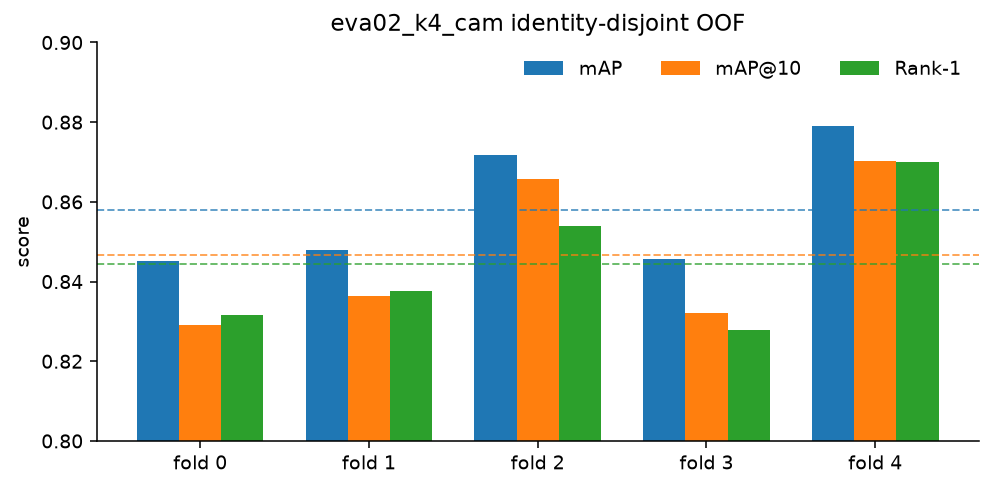

*Identity-disjoint 5-fold OOF on EVA02 (`runs/cv/eva02_trial23`). Query-weighted means: mAP 0.847,
mAP@10 0.834, Rank-1 0.842. Fold 4 is the strongest; fold 3 is the weakest. Checkpoint selection
and Optuna still use full-gallery mAP; mAP@10 is the contest ranking metric. GroupKFold stays.
Identity-bootstrap 95% CIs (2000 resamples): mAP [0.833, 0.860], mAP@10 [0.820, 0.849], Rank-1
[0.824, 0.861]. Fold mAP std is 0.009. Optuna used these same folds, so this is not a locked
post-selection test. OOF is fold extractors; serving `eva02.pt` is a full-retrain on every labeled
identity.*

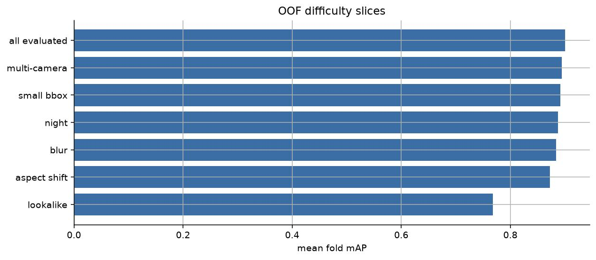

*Lookalikes (impostor cosine ≥ 0.55) and strong bbox-aspect shifts are the weak slices (mAP 0.765
and 0.782). Night / blur / small bbox are closer to the mean. Subsampling each val gallery to 750
(test size) raises mAP slightly (0.853) and drops Rank-1 (0.829). Notebook:
`notebooks/eva02/oof_analysis.ipynb`.*

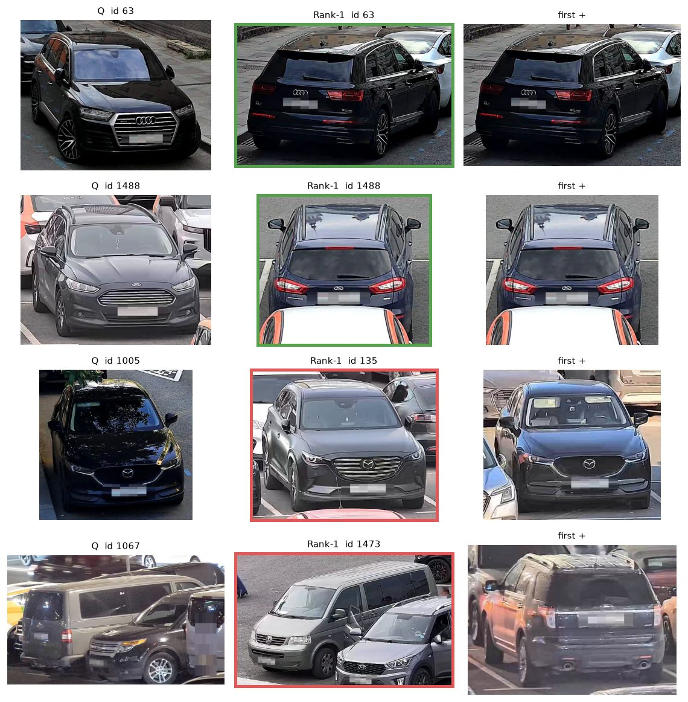

*Fold-0 examples. Green Rank-1 is a correct identity; red is a lookalike. The third column is the
first true positive in the ranking. Hard misses are usually the same body style and color, not a
random vehicle. Full case study: `notebooks/eva02/oof_analysis.ipynb`.*

### Labeled-only vs HDBSCAN mcs4 (experiment, not serving)

HDBSCAN on the public test set was tried as extra train identities. It is **not** in the submitted
recipe (`weights/finetuned/eva02.pt` stays labeled-only trial23). The two identity-disjoint OOF
runs share query/gallery rows and fold assignment; only the embedding changes.
`notebooks/eva02/oof_compare.ipynb` compares per-query ranking, neighbor lists, and the 256-D spaces.

| | labeled-only `eva02_trial23` | + HDBSCAN mcs4 |
| --- | ---: | ---: |
| mAP | 0.847 | 0.857 |
| mAP@10 | 0.834 | 0.846 |
| Rank-1 | 0.842 | 0.853 |
| mean first-positive rank | 2.70 | 2.16 |
| Rank-1 rescue / break | — | 83 / 66 |
| same Rank-1 image | — | 55% |
| top-5 / top-10 overlap | — | 0.73 / 0.67 |
| fold-0 intra-id cosine | 0.76 | 0.82 |
| fold-0 cross-camera positive | 0.68 | 0.76 |
| same-image cosine (raw → Procrustes) | — | ≈0 → 0.83 |
| linear CKA | — | 0.76 |

mcs4 was a net OOF gain, not a uniform lift: 336 queries gain AP, 278 lose, 927 stay put. Neighbor
lists move more than the metric — only 55% keep the same Rank-1 image. The two bases are rotated
(raw same-image cosine ≈ 0) but agree after an orthogonal Procrustes map. Same-identity views get
tighter; sampled negatives stay near 0. Serving does not use this run.

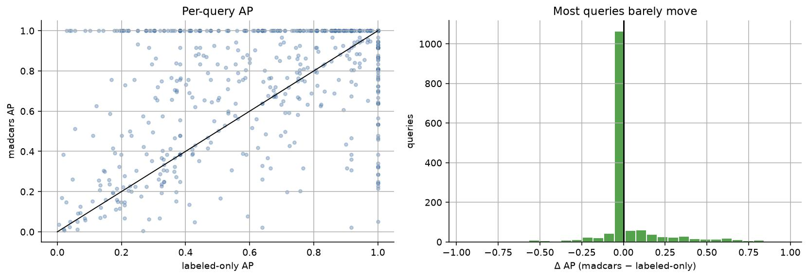

*Each point is one of 1541 orig-identity OOF queries. The spike at ΔAP = 0 is 927 unchanged
queries. Off-diagonal tails are Rank-1 rescues and breaks.*

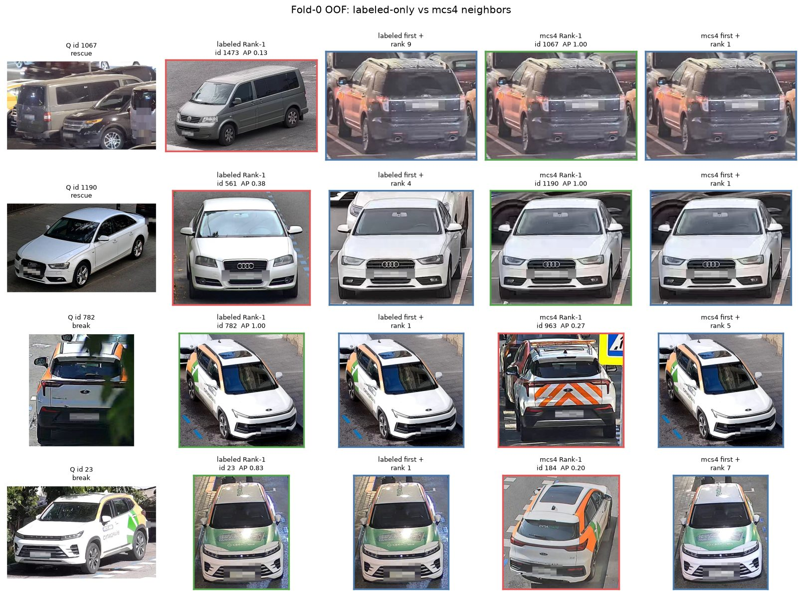

*Rows 1–2: mcs4 rescues (id 485, 590) where labeled-only Rank-1 was a lookalike. Rows 3–4: breaks
(id 1321, 513) where labeled-only was already correct. Green is the true identity; red is not.*

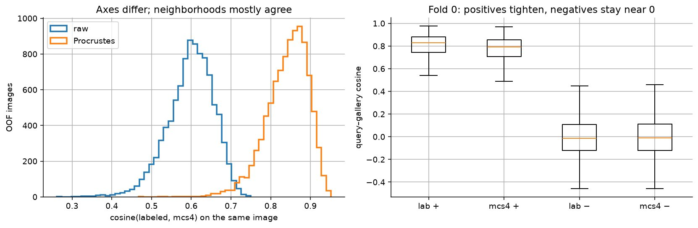

*Left: cosine of the two models on the same OOF image, raw vs after Procrustes. Right: fold-0
query–gallery cosines. Positives shift up; negatives stay near zero.*

### Full retrain

`data.full_retrain=true` trains on every competition identity (all five fold groups). There is no
held-out val split and no `val/mAP` checkpoint monitor: Lightning saves `last.ckpt` after a fixed
epoch budget. `eval.split=val` refuses that checkpoint, because train IDs cover the held-out fold.

Set the budget to the rounded mean of the five best-checkpoint **completed** epoch counts from an
identity-disjoint CV run. Lightning filenames are 0-based (`epoch025.ckpt` means 26 completed
epochs). For labeled-only `runs/cv/eva02_trial23` that is `(26+26+25+22+13)/5 = 22.4 → 22`, so
`train.epochs=22` (epochs 0–21). Pass `data.cv_dir=` to compute that mean inside `train.py`;
otherwise keep `train.epochs` as in the experiment YAML. Init from the LLM2CLIP Hub snapshot, not
from a previous serving full-retrain `.pt` (that checkpoint has already seen every original
identity).

```bash
.venv/bin/python train.py \
  experiment=current_best_tuned \
  data.full_retrain=true \
  data.cv_dir=runs/cv/eva02_trial23 \
  model.local_files_only=true \
  model.checkpoint_path=weights/llm2clip/LLM2CLIP-EVA02-L-14-336.pt \
  output_dir=runs/full/eva02_trial23
```

Export the last EMA weights for contest serving. This is the default `scripts/export_serving.py`
source when `runs/full/eva02_trial23/run_summary.json` exists:

```bash
.venv/bin/python scripts/export_serving.py \
  --checkpoint runs/full/eva02_trial23/checkpoints/last.ckpt \
  --output weights/finetuned/eva02.pt \
  --weights ema \
  --sha256
```

Refit CatBoost in that same embedding space. `--nested` retunes cosine and CatBoost operating points
from identity-disjoint fold-OOF inner CV on **20% identity-hold-out** eval packs (serving: cosine
`0.6638`, CatBoost `0.5540`). CatBoost still trains on 50/50 stripped-identity pairs; F1/TNR and
the contest operating point do not. `--full-retrain` re-embeds the five CV query/gallery splits with
the serving checkpoint (all identities, one model) and fits the same 200/4/0.08 recipe on every
50/50 pack. Full-retrain packs are in-sample and must not overwrite those nested points. CLI rejects
`--full-retrain --update-config` (that used to write a CatBoost threshold fit on the same training
packs). `eval.py` cannot build this pack: the full-retrain checkpoint contains every identity, so
`eval.split=val` is rejected.

```bash
.venv/bin/python scripts/export_refusal.py \
  --nested \
  --cv runs/cv/eva02_trial23 \
  --update-config
.venv/bin/python scripts/export_refusal.py \
  --full-retrain \
  --cv runs/cv/eva02_trial23 \
  --checkpoint runs/full/eva02_trial23/checkpoints/last.ckpt \
  --device cuda:2 \
  --output weights/finetuned/eva02_catboost.cbm \
  --sha256
```

Omit `--full-retrain` to keep the 5-fold OOF CatBoost. Omit `--nested` to keep the frozen YAML
thresholds.

### Iterative test pseudo-labeling (tried, not used)

This is an experiment. Serving and `current_best_tuned` stay on labeled-only `eva02_trial23`
(`runs/full/eva02_trial23` → `weights/finetuned/eva02.pt`). Jointly clustering the whole public
`test_query` with `test_gallery` is not part of the submitted recipe.

Each iteration treats unlabeled `test_query.csv` + `test_gallery.csv` crops as extra identities:

1. Embed every unique test image with the current best EVA02 serving checkpoint (`embed_frame`, same
   context-TTA average as `eval.py`).
2. Cluster L2-normalized embeddings with `sklearn.cluster.HDBSCAN` (cosine ≈ Euclidean).
3. Drop noise label `-1`. Keep clusters as new `vehicle_id`s after `max(train.vehicle_id)`.
4. Write `train.csv` = original labeled train plus those rows (`camera_id=-1` if the test CSV has none).
5. Fine-tune from the LLM2CLIP snapshot on orig train plus clusters. GroupKFold hold-out stays on original identities only (`data.val_source_csv`); test pseudo-labels get `fold=-1` and are always in train. Do not init from a previous serving full-retrain `.pt`.
6. Repeat from step 1 with the new checkpoint. Noise `-1` should shrink as the embedding space tightens.

Always merge against the original labeled `data/train.csv`, not the previous pseudo CSV. Cluster IDs are recomputed from scratch each iteration. Use a new `data.folds_file` so `artifacts/folds.csv` stays tied to the original train fingerprint.

Stage 1 (embed + cluster, GPU 2):

```bash
PYTHONUNBUFFERED=1 scripts/pseudo_label.sh cuda:2
```

Writes `runs/pseudo/iter001/` (`embeddings.npy`, `clusters.csv` including `-1`, merged `train.csv`, `summary.json`). Defaults: `weights/finetuned/eva02.pt`, `min_cluster_size=4`, `min_samples=4`, `allow_single_cluster=false`. `allow_single_cluster=true` can collapse the test set into one identity. Reuse embeddings with `--embeddings runs/pseudo/iter001/embeddings.npy`. Next round: `ITER=2 OUTPUT=runs/pseudo/iter002_mcs4 CHECKPOINT=weights/finetuned/eva02.pt`. `summary.json` records the clustering checkpoint and `next_train` Hydra data overrides (`train_csv`, `folds_file`, `val_source_csv`). It does **not** set `init_checkpoint`: that clustering `.pt` already saw original identities (a serving full-retrain, or even one fold, has seen IDs that later folds hold out). Identity-disjoint CV must init from the Hub snapshot, not from `summary.json` `checkpoint`.

Measured HDBSCAN mcs=4 rounds (embed with the then-current serving `.pt`, merge onto original `data/train.csv`):

| | clusters | labeled test | noise | merged train | orig-ID OOF mAP / mAP@10 / Rank-1 |
| --- | ---: | ---: | ---: | --- | ---: |
| labeled-only `eva02_trial23` | — | — | — | 9556 / 1541 IDs | **0.847 / 0.834 / 0.842** |
| iter1 `runs/pseudo/iter001_mcs4` | 234 | 1626 | 13% (234) | 11182 / 1775 IDs | 0.857 / 0.846 / 0.853 |
| iter2 `runs/pseudo/iter002_mcs4` | 239 | 1738 | 6.6% (122) | 11294 / 1780 IDs | 0.856 / 0.845 / 0.850 |

Iter2 tightened the clusters (noise 13% → 6.6%) but did not beat iter1 OOF (mAP −0.0004, Rank-1 −0.003).
Neither round is used at serve. Neighbor/embedding compare vs labeled-only:
`notebooks/eva02/oof_compare.ipynb`.

5-fold CV on orig identities, every test pseudo-label in train, GPUs 3–7. Init from the LLM2CLIP snapshot, not from a serving full-retrain `.pt`:

```bash
PYTHONUNBUFFERED=1 \
EXPERIMENT=current_best_tuned \
RUN_ROOT=runs/cv/pseudo_iter001_mcs4 \
MODEL_CHECKPOINT=weights/llm2clip/LLM2CLIP-EVA02-L-14-336.pt \
scripts/train_folds.sh 3,4,5,6,7 \
  data.train_csv=runs/pseudo/iter001_mcs4/train.csv \
  data.folds_file=runs/pseudo/iter001_mcs4/folds.csv \
  data.val_source_csv=data/train.csv
```

Same command with `iter002_mcs4` paths produced `runs/cv/pseudo_iter002_mcs4` (best-ckpt epochs `(15+21+12+17+14)/5 = 15.8 → 16`). Direct CLI: `.venv/bin/python scripts/pseudo_label.py --device cuda --iter 1`. `init_checkpoint` still accepts a serving `.pt` or a Lightning `.ckpt` for other recipes (SSL, extra-data pretrain); `mask_token` (DINO-only) may be missing and is ignored. Do not pass the clustering or serving full-retrain `.pt` as `init_checkpoint` for these orig-identity folds.

For multi-device training, the entrypoint selects a DDP strategy when `trainer.strategy=auto`.
Training uses manual optimization so gradient accumulation, AWP, scheduler updates, and EMA
updates happen in a defined order.

Outputs are written below `output_dir` and include:

- Resolved `config.yaml`.
- Persisted train/query/gallery split CSV files.
- `label_map.json`.
- Lightning logs.
- Last and monitored checkpoints.

### Resume safety

Resume training from a checkpoint:

```bash
.venv/bin/python train.py resume=/path/to/last.ckpt
```

The checkpoint is accepted only if its data fingerprint and label mapping match the current fold.
This prevents accidental continuation on different data or a different identity-to-class mapping.

### External pretraining

`pretrain.py` trains on 100% of one or more extra datasets and validates against 100% of the
competition `train.csv` query/gallery split. Use this to produce a backbone/head checkpoint that
can initialize ordinary competition training.

Train on VeRi, VRIC, or both. `scripts/pretrain.sh` selects the GPU, Hydra model group, extra
datasets, and experiment recipe. It defaults to `experiment=current_best_tuned` and local
`weights/` checkpoints:

```bash
scripts/pretrain.sh cuda:2 dinov3_convnext_base veri
scripts/pretrain.sh cuda:2 llm2clip vric
scripts/pretrain.sh 2 dinov3_convnext_base veri,vric
scripts/pretrain.sh cuda:2 radio both smoke
scripts/pretrain.sh cuda:2 llm2clip test_train_ssl_crop
scripts/pretrain.sh cuda:2 llm2clip test_train_ssl_full
```

The first argument is `cuda:N` or `N`. The second is the Hydra model group. The third is `veri`,
`vric`, `veri,vric`, `both`, `test_train_ssl_crop`, or `test_train_ssl_full` (`test_train_ssl` is a
crop alias). An optional fourth token without `=` is the experiment name; otherwise extra tokens are
Hydra overrides. LLM2CLIP is forced to 336 × 336 and `local_parts=0`. SSL replaces the experiment
loss with DINOv3-style DINO/iBOT/KoLeo/Gram and sets `data.sampler.kind=random`. Set
`EXPERIMENT`, `MODEL_CHECKPOINT`, `NAME`, or `PYTHON` to override the defaults.

Direct Hydra remains available:

```bash
.venv/bin/python pretrain.py experiment=current_best_tuned model=llm2clip pretrain.datasets=[veri]
.venv/bin/python pretrain.py experiment=current_best_tuned model=llm2clip pretrain.datasets=[vric]
.venv/bin/python pretrain.py experiment=current_best_tuned model=llm2clip \
  pretrain.datasets=[test_train_ssl_crop]
.venv/bin/python pretrain.py experiment=current_best_tuned model=llm2clip \
  pretrain.datasets=[test_train_ssl_full]
```

The default config mixes VeRi and VRIC. Identity and camera IDs are remapped so mixed sources do
not collide. Outputs include the usual Lightning checkpoints plus `run_summary.json` with dataset
names, image counts, and checkpoint paths.

Initialize a competition fold from the pretrain checkpoint. Keep the model, pooling, and embedding
head the same. Do not use `resume` for this transfer: pretraining uses a different identity space
and data fingerprint, so `train.py` would reject that checkpoint.

```bash
.venv/bin/python train.py \
  experiment=current_best_tuned \
  init_checkpoint=runs/pretrain/llm2clip_veri/<run>/checkpoints/<ckpt>.ckpt \
  data.fold=0
```

`init_checkpoint` loads `model.*` weights only. A serving `.pt` (`format=reid-serving`) is accepted;
EMA shadows from a Lightning checkpoint are used when `validation_weights=ema`. Losses and classifiers
are created for the competition identity count, so the DINO prototype head is not transferred.
`mask_token` may be absent from a non-SSL serving payload. `resume` and `init_checkpoint` cannot be
set together.

## Evaluation and retrieval

Evaluate the validation split:

```bash
.venv/bin/python eval.py \
  checkpoint=weights/finetuned/eva02.pt \
  eval.split=val
```

`eval.py` keeps model/data/augmentation from the checkpoint Hydra cfg, then applies the current H7
junk protocol (`data.validation.exclude_all_same_camera=false`) unless that key is an explicit CLI
override. llm2clip serving also turns on fused SDPA and `torch.compile` (`prepare_inference_model`)
unless `model.compile=false`. Older checkpoints stored `true` (drop every gallery crop on the query
camera). Eval no longer keeps that mask, so validation scores are not inflated relative to H7. To
reproduce the old filter: `data.validation.exclude_all_same_camera=true`.

Generate test query/gallery retrieval results:

```bash
.venv/bin/python eval.py \
  checkpoint=weights/finetuned/eva02.pt \
  eval.split=test
```

`eval.py`, `scripts/export_refusal.py --full-retrain`, and `scripts/pseudo_label.py` share
`embed_frame`: when `eval.tta.enabled` is true they extract every `eval.tta.context_pcts` crop and
average before L2. Scale/rotation/flip TTA still runs inside each crop via `embed_loader`.

Open-set refusal is applied only to contest `candidates.csv`. Serving heads and frozen thresholds
live in `configs/refusal/`. Default local `refusal=none` writes every query. The contest Docker
image defaults to `refusal=eva02_threshold` (max query–gallery cosine ≥ 0.6638). EVA02 serving
presets drop refused queries: **no rows**
for that `query_id` (not an empty `gallery_id`, not a sentinel). `submission.csv` is ranking-only:
exactly `eval.top_k` (10) gallery IDs for **every** query, including open-set and refused ones, with
no score column and no skipped `query_id`.

```bash
.venv/bin/python eval.py checkpoint=weights/finetuned/eva02.pt eval.split=test refusal=eva02_threshold
.venv/bin/python eval.py checkpoint=weights/finetuned/eva02.pt eval.split=test refusal=eva02_model
.venv/bin/python eval.py checkpoint=weights/finetuned/eva02.pt eval.split=test refusal=eva02_ensemble
```

`eva02_model` and `eva02_ensemble` need a `.cbm` at `refusal.model_path` (default
`weights/finetuned/eva02_catboost.cbm`). They are optional overrides; Docker does not load CatBoost.
Export the head from EVA02 OOF embeddings with `scripts/export_refusal.py`. Thresholds in the YAMLs
are frozen nested 5-fold inner-CV maxima of `0.7 × F1 + 0.3 × TNR` on 20% identity-hold-out eval
packs, not retuned on the test set. TabM remains a `refusal/` calibration head and is not a submit
preset.

Select checkpoint weights with:

```bash
eval.weights=auto
eval.weights=raw
eval.weights=ema
```

`auto` uses the weight kind stored in the file (`validation_weights` on a Lightning `.ckpt`,
`weights` on a serving `.pt`). Requesting EMA weights from a checkpoint without EMA state is an
error. A serving `.pt` contains one exported set (usually EMA); asking for the other kind is an
error.

Evaluation preserves the original query and gallery CSV order. It refuses query/gallery image
overlap because no implicit self-match policy is assumed.

### Zero-shot pretrained probe

`scripts/zero_shot.py` scores a Hydra model config on 100% of `train.csv` without training. The
query/gallery split is the same protocol `pretrain.py` uses for extra-data validation: one query per
identity when a cross-camera positive exists, remaining images as gallery. Random projection,
BN-neck, and attention pooling are disabled so the pretrained backbone features are used directly.
GAP pooling is the default; Hydra overrides still apply after those defaults.

Probe DINOv3 ConvNeXt Base from local weights:

```bash
.venv/bin/python scripts/zero_shot.py dinov3_convnext_base \
  model.checkpoint_path=weights/dinov3_base/model.safetensors \
  model.local_files_only=true \
  eval.device=cuda:2
```

Run every backbone in `weights/` sequentially on one device. The device is the first argument
(`cuda:2`, `cuda:0`, and so on). Per-model metrics go to `artifacts/zero_shot/<model>/metrics.json`,
and a combined file is written to `artifacts/zero_shot/summary.json`:

```bash
scripts/zero_shot_weights.sh cuda:2
```

Measured out-of-the-box retrieval on 100% of competition `train.csv` (1541 queries, 5550 gallery
images, cross-camera protocol, no TTA or reranking). Junk is same `vehicle_id` and `camera_id`;
other identities on the query camera stay in the gallery. These scores are a pretrained-backbone
probe, not identity-disjoint fold OOF. `mAP` is full-gallery average precision; `mAP@10` is the
official submission metric (top-10, denominator `min(n_pos, 10)`).

| Model | mAP | mAP@10 | Rank-1 | Rank-5 | Rank-10 | mINP |
| --- | ---: | ---: | ---: | ---: | ---: | ---: |
| DINOv3 ConvNeXt Base | 0.168 | 0.141 | 0.162 | 0.286 | 0.356 | 0.114 |
| DINOv3 ConvNeXt Large | 0.182 | 0.152 | 0.167 | 0.310 | 0.399 | 0.132 |
| RADIO C-RADIOv4-SO400M | 0.148 | 0.123 | 0.147 | 0.263 | 0.319 | 0.098 |
| LLM2CLIP EVA02-L-14-336 | 0.301 | 0.268 | 0.313 | 0.471 | 0.580 | 0.212 |

### Test-time augmentation

TTA is configured in `eval.tta`:

```bash
.venv/bin/python eval.py \
  checkpoint=weights/finetuned/eva02.pt \
  eval.tta.enabled=true \
  eval.tta.hflip=true \
  eval.tta.scales='[0.9,1.0,1.1]' \
  eval.tta.rotations='[-5,0,5]'
```

Embeddings from all enabled views and bounding-box context values are averaged and normalized.
Five-fold OOF TTA on labeled-only `runs/cv/eva02_trial23` is hflip ± small rotation ~+0.002 mAP.
`current_best_tuned` leaves TTA off.

### Embedding interpretation

`interp/` attributes a retrieval embedding, not a classifier logit. The default target is
pre-normalization embedding energy; pass a gallery vector as `reference` to explain
`cosine(query, gallery)` instead. `interpret_pair` embeds both images, then attributes each
side of that cosine.

| Method | What it shows |
| --- | --- |
| `pooling` | Spatial weights of the trained attention pooler (the aggregation the embedding actually uses) |
| `last_attn` | Last-layer CLS-to-patch attention, averaged over heads |
| `rollout` | Attention rollout with residual identity (Abnar & Zuidema, 2020); image-general, not pair-specific |
| `grad_rollout` | Same residual rollout, but attention is weighted by the cosine-similarity gradient |
| `chefer` | Transformer attribution: attention × gradient relevancy (Chefer et al., 2021) |
| `gradsim` | `|grad × activation|` on last patch tokens with cosine (or energy) as the scalar target |
| `gradcam` | Grad-CAM on the last backbone feature map (Selvaraju et al., 2017) |
| `hirescam` | HiResCAM, element-wise gradient × activation |
| `layercam` | LayerCAM, ReLU(gradient) × activation |
| `eigencam` | EigenCAM, first principal component of activations (no labels/gradients) |
| `occlusion` | Cosine (or energy) drop after zeroing a patch block; `block=` groups the backbone grid |

```python
from interp import interpret, interpret_pair, overlay

maps = interpret(model, images, method="gradcam")
maps = interpret(model, images, method="chefer", reference=gallery_embedding)
query_maps, gallery_maps, cosine = interpret_pair(
    model, query, gallery, method="gradsim", block=4
)
canvas = overlay(crop_hwc, query_maps[0])
```

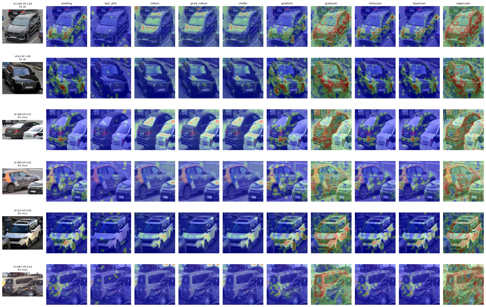

*Each row is one fold-0 OOF query. `pooling` is the trained spatial attention that actually builds
the embedding. `last_attn` / `rollout` are CLS maps (this recipe does not retrieve with CLS). CAM
methods here use embedding energy (no gallery vector). Occlusion is skipped in this grid because
EVA02's 24×24 patch grid is too many forwards.*

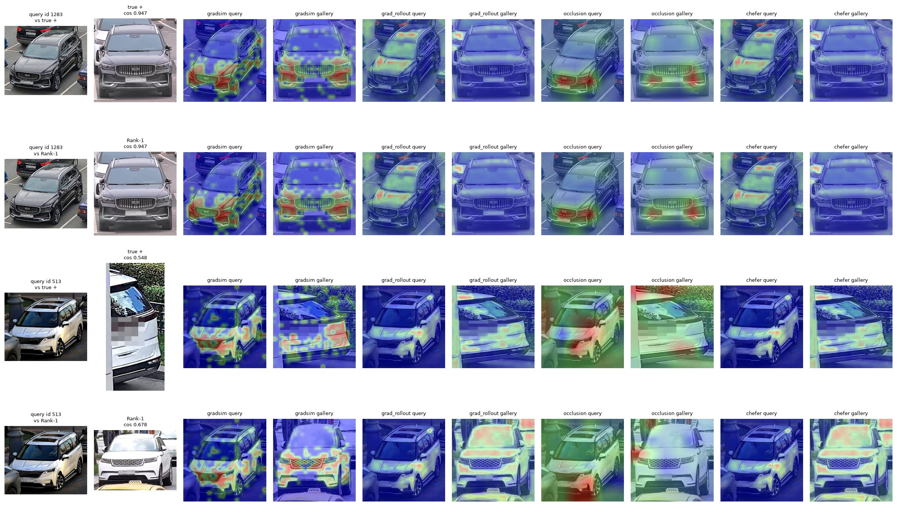

*Pair maps: `interpret_pair` backprops `cosine(z_q, z_g)` into both crops. Columns are query and
gallery for `gradsim`, `grad_rollout`, `occlusion` (`block=4`), and `chefer`. Rows alternate true
positive vs Rank-1. Warm regions are the patches that currently support that cosine. Notebook:
`notebooks/eva02/interp.ipynb`.*

### Pair matching (EfficientLoFTR)

`matching/` runs detector-free semi-dense correspondence on a query/gallery crop pair using the
local Hugging Face checkpoint `weights/efficientloftr`. The embedding ranker still decides the
shortlist. Matching is a second opinion on that shortlist: how many keypoints correspond, how
confident those correspondences are, and how many survive a homography RANSAC.

| Output | Meaning |
| --- | --- |
| `n_matches` | Correspondences above the matcher threshold (default 0.2) |
| `score_sum` / `score_mean` | Sum / mean of those correspondence scores |
| `n_inliers` / `inlier_ratio` | RANSAC homography inliers; a geometric check that the matches are consistent |

`reorder_head` re-sorts only the cosine top-`k`. `hybrid_head` min-max mixes cosine and a match
statistic inside that head. The matcher is not applied to the full gallery.

```python
from matching import draw_matches, load_matcher, match_pair, match_stats, reorder_head

processor, matcher = load_matcher("weights/efficientloftr", device="cuda:2")
pair = match_pair(processor, matcher, query_crop, gallery_crop, threshold=0.2)
stats = match_stats(pair["keypoints0"], pair["keypoints1"], pair["scores"])
canvas = draw_matches(query_crop, gallery_crop, pair["keypoints0"], pair["keypoints1"], pair["scores"])
order = reorder_head(cosine_order, inlier_counts, k=10)
```

Local weights only (`local_files_only=True`). Download `zju-community/efficientloftr` with
`scripts/download_weights.py efficientloftr`. The checkpoint is gitignored under `weights/` like
other Hub snapshots; it is not part of contest serving.

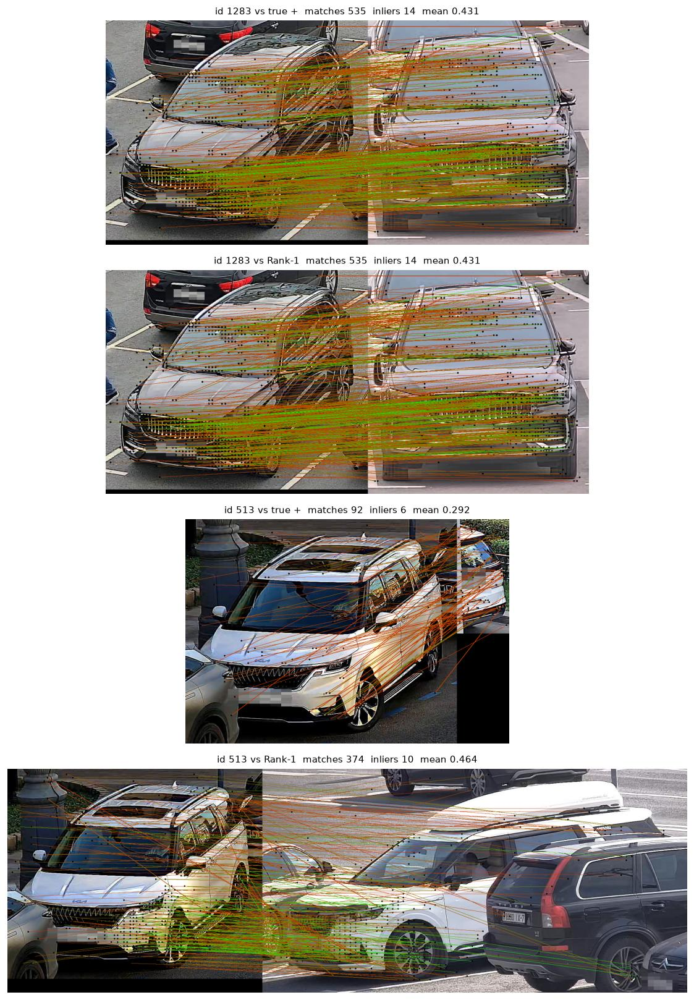

*Green lines are high-score correspondences. An easy true pair (id 1283, Rank-1 is the same
identity) and a Rank-1 miss (id 1005) vs its true positive and vs the distractor. `n_matches` can
fire on similar paint; `n_inliers` is the stricter geometric check.*

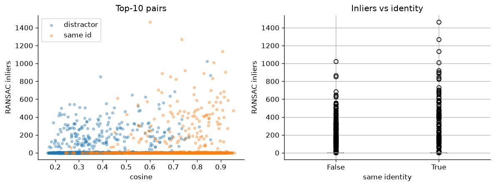

*Every fold-0 query's cosine top-10, scored by EfficientLoFTR. Same-id pairs have more inliers on
average (56 vs 33), but the clouds overlap. Replacing the embedding Rank-1 with inlier count
**hurts** (Rank-1 0.838 → 0.479). Matching is a visualization / second opinion, not a ranker.
Notebook: `notebooks/eva02/matching.ipynb`.*

### Embedding robustness (post-hoc)

`posthoc/` measures whether the retrieval embedding is stable under input corruptions. The gallery
stays clean. Each query crop is replaced with `k` corrupted copies (severity 1–5). Metrics compare
the corrupted queries to the original query, not to a new trained model.

| Metric | What it measures | Robust if |
| --- | --- | --- |
| `cosine_mean` / `cosine_min` / `cosine_std` | cosine(clean embedding, each of the `k` corrupted embeddings) | close to 1 / 1 / 0 |
| `angular_mean_deg` | mean arccos(cosine) in degrees | close to 0 |
| `pairwise_cosine` | agreement among the `k` copies of one query | close to 1 |
| `overlap` / `jaccard` | set overlap / IoU of clean vs corrupted top-`k` gallery neighbors | close to 1 |
| `kendall` | Kendall-τ on the union of those two top-`k` lists | close to 1 |
| `orig_r1_rank` | rank of the clean Rank-1 gallery image after the query is corrupted | 1 |
| `rank1_image_same` / `rank1_id_same` | same gallery image / same identity still at Rank-1 | 1 |
| `delta_ap` | AP(corrupted query, clean gallery) − AP(clean query) | close to 0 |
| `delta_mean_pos_rank` | shift of true-positive ranks | close to 0 |
| `psnr` / `l1` | pixel distortion of the crop (context for the drop) | — |

Corruptions: `identity`, `gaussian_noise`, `impulse_noise`, `gaussian_blur`, `motion_blur`, `jpeg`,
`brightness`, `contrast`, `saturate`, `downsample`, `occlude`, `rotate`, `crop`, `fog`.

```python
from posthoc import apply_k, compare_query, embed

crops = apply_k(query_rgb, "jpeg", severity=3, k=4, seed=0)
row = compare_query(
    clean_emb, corrupted_emb, gallery_emb, qid=qid, gids=gids, keep=keep, k_neighbors=10
)
```

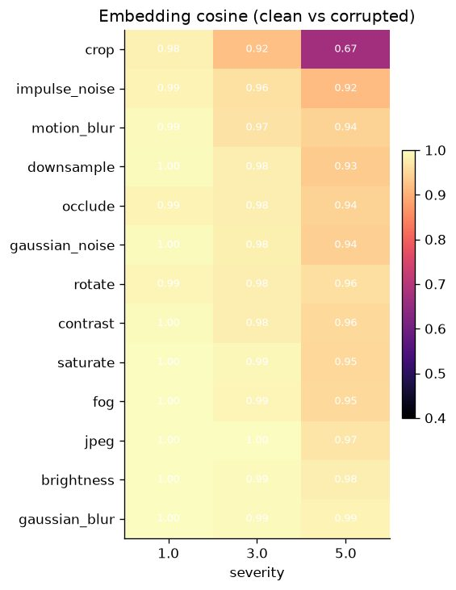

*Gallery stays clean. Each cell is mean cosine(clean query, corrupted query) over fold-0 OOF.
JPEG / blur / color barely move the embedding. Hard crops (`crop` severity 5 → 0.59) and heavy
occlusion / downsample do.*

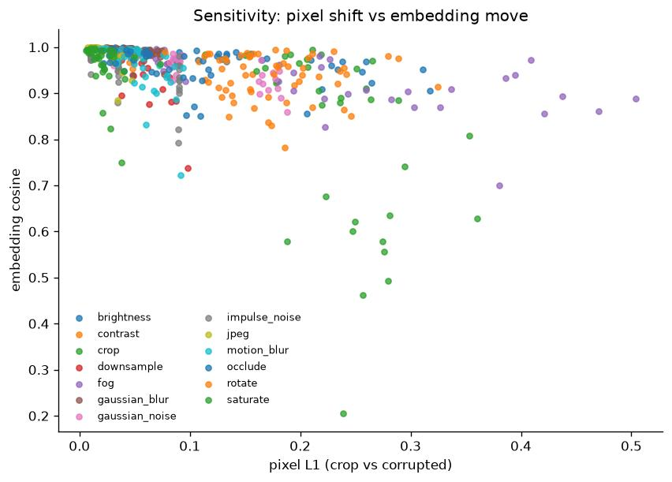

*Same probe: how much the crop has to change in pixels before the 256-D vector moves. Aggressive
re-crops drop cosine far more than an equivalent L1 of noise. Notebook:
`notebooks/eva02/posthoc_stability.ipynb`.*

### Postprocessing

The closed test is a **stream**: the full `test_gallery.csv` is a static database and may be
indexed in advance; each `test_query.csv` row is handled independently. Other test queries and
their results are not available. `submission.csv` is the final ranking after any allowed rerank
(cosine search, then optional pairwise/local-feature or k-reciprocal inside that query's top-K).
It does not have to match a raw nearest-neighbor list from `embeddings.npy`.

Allowed at serve (`postproc.streaming=true`, the default):

- Per-image TTA (flip, rotation, scale, extra bbox context of the current crop).
- Gallery-only mutual-neighbor aggregation (the gallery is static).
- k-reciprocal or GNN rerank of **one query** against the gallery (no query–query graph).

Not used at serve, even though the code still exists for local OOF:

- Average query expansion, including `gallery_only` AQE. Organizers forbid query expansion.
- Joint k-reciprocal / GNN over the whole query batch (`q @ q.T`).
- Clustering or other methods that mix test queries.

`eval.py` raises if AQE is enabled under streaming. Five-fold TTA and postproc sweeps live on
labeled-only `runs/cv/eva02_trial23` (AQE q+g 0.859, DBA k=5 sim³ 0.860, TTA ~+0.002, TTA
hflip+rot4 + AQE q+g 0.862). Those numbers are not the submission recipe.
`current_best_tuned` leaves postproc off.

```bash
.venv/bin/python eval.py \
  checkpoint=weights/finetuned/eva02.pt \
  postproc.enabled=true \
  postproc.gallery_aggregation.enabled=true \
  postproc.rerank.kind=k_reciprocal
```

Dense reranking estimates its memory requirement before allocation and stops when it exceeds
`postproc.max_dense_gb`.

### Evaluation artifacts

The evaluation directory contains:

- `embeddings.npy`: contest embedding matrix for `eval.split=test`. Rows are `test_query.csv` in
  file order, then `test_gallery.csv` in file order, with no extra sort. Shape
  `(len(query)+len(gallery), D)`, `float32`. Vectors are L2-normalized after TTA; the official
  scorer also L2-normalizes, so that is optional on their side. `query_id` / `gallery_id` are
  `image_id`. Local `eval.split=val` writes the same file over the held-out fold table instead.
- `retrieval_embeddings.npy`: query and gallery embeddings after enabled expansion stages.
- `distances.npy`: final query-to-gallery distance matrix, when enabled.
- `submission.csv`: wide top-10 table `query_id,gallery_id_1,...,gallery_id_10`. One row per query
  in CSV order, including open-set and refused queries. No `confidence` column. Empty cells and
  skipped queries are invalid here; refusal is not expressed in this file.
- `candidates.csv`: contest accept/refuse file. Columns `query_id,gallery_id,confidence` in that
  order, header required. `confidence` is a monotone similarity score (higher = more confident);
  the range need not be `[0, 1]`. Organizers rank by this value and take the **max-confidence**
  row per `query_id`. Extra rows below that top candidate do not affect F1 or TNR; there is no
  cap on row count. `refusal=` (`none` / `eva02_threshold` / `eva02_model` / `eva02_ensemble`)
  decides which queries are written. A refused query has **no rows**. Empty `gallery_id` and
  placeholder values are not written. Organizers do **not** apply a second threshold to
  `confidence`; including a `query_id` is the accept decision.
- `query.csv` and `gallery.csv`: exact evaluated row order.
- `embedding_order.csv`: sidecar `image_id` list for `embeddings.npy` (not required by the scorer).
- `metrics.json`: run metadata and validation metrics when labels are available.
- `config.yaml`: resolved evaluation configuration.

Validation reports full-gallery mAP (checkpoint selection and Optuna), official mAP@10 over the
submission top-10, mINP, and configured CMC ranks. After junk filtering (same-camera **and**
same-identity gallery images), queries with no remaining valid positive are **excluded from the
mAP@10 / Rank-1 / Rank-5 average**, not scored as AP=0. Gallery images of a *different* identity
on the query camera stay in the ranking. That includes unmarked open-set queries (~20% of the
closed test) and any query whose only gallery positive was junk. Those queries are scored only
through `candidates.csv` (F1, TNR), where the correct output is a refusal (no row). Evaluation
fails if no query has a valid positive.

### Contest inference profile

Organizer timing is the full `extract()` cycle on one vehicle: disk read, decode, bbox crop,
preprocessing, forward, postprocessing, L2. Gallery search and re-ranking are excluded — they scale
with gallery size, not with the embedding model. `profiling/` reproduces that protocol. When
`eval.tta.enabled` is true, the timed `extract()` path averages the same views as `eval.py`:
scales, rotations, flips, and every `eval.tta.context_pcts` crop. The published serving-checkpoint
numbers use TTA off, so they are unchanged.

- `latency_b1`: median of 300 timed batch-1 cycles after 50 warmups, with CUDA synchronize before
  and after every timed sample.
- `throughput`: sustained images/s at batch sizes 1 / 8 / 16 / 32, each run at least 10 seconds.
  The score uses the best FPS.
- Also recorded: peak VRAM, weight-load time (reference), total weight-file bytes, two-run
  determinism. Stage bars are a separate diagnostic: they run after the same warmup as `latency_b1`,
  but each stage still synchronizes CUDA, so they must not be added up to explain the scored cycle.

Performance is 20% of the contest score: `10% × latency_score + 10% × throughput_score`.

| | Full score | Linear | Zero |
| --- | --- | --- | --- |
| Latency (batch=1, full cycle) | ≤ 40 ms | 40–80 ms | > 80 ms |
| Throughput (best FPS) | ≥ 100 | 50–100 | < 50 |

Weight files above 2 GiB are **not admitted** to this performance evaluation (no partial penalty).
The 2 GiB cap is the sum of every inference weight file in the solution directory with suffix
`.pt .pth .bin .onnx .engine .plan .safetensors .ckpt .trt .pb .tflite .npz`. Auxiliary CatBoost
`.cbm` files are reported by `profiling/` but are **not** in that official glob.

The run-time budget is about `latency_b1 × n_test × 3` (~4 minutes at the current closed-test
size). Organizers pass the image directory and CSV (`image_id, x, y, w, h`) as a batch; one
`docker run --gpus all` (or Compose equivalent) must write `submission.csv`, `embeddings.npy`, and
`candidates.csv`. Streaming independence (no query expansion, no use of other test queries) is
checked in source at the final review, not by the launch format.

`notebooks/eva02/inference_profile.ipynb` charts stage costs, latency, FPS vs batch, VRAM, the
weight inventory against the 2 GiB cap, and these performance scores. Isolated H200 (`cuda:2`,
TTA off, bf16, serving `eva02.pt`, torch 2.8.0+cu128 / CUDA 12.8, driver 575.57.08):

| Metric | Value |
| --- | --- |
| `latency_b1` | **15.9 ms** (p90 16.4 ms) |
| `throughput` | **229.8 FPS** at batch 32 (batch 1 is 63.4 FPS) |
| Peak VRAM | 1.14 GiB @ b1 → **1.18 GiB @ b32** |
| Load | 4.8 s (compile graph is paid in warmup, not in timed extract) |
| Serving `eva02.pt` | **~1.14 GiB** (under the 2 GiB cap) |
| Determinism | bit-identical on two compiled extracts |
| Official performance | latency_score **1.0**, throughput_score **1.0**, **0.200 / 0.20** |

Serving kernels (`models/kernels.py`, applied by `eval.py` via `prepare_inference_model`):

- Fused SDPA after RoPE (`model.attn_kernel=sdpa`). Math vs SDPA embeddings were bit-identical.
  Forced Flash/mem-efficient SDPA did not beat H200 math at batch=1; keep SDPA for compile fusion.
- `torch.compile(mode=reduce-overhead)` at load. Forward **19 → 5.7 ms**. Compile vs eager min
  cosine 0.99988 on 32 crops. First-forward compile (~45 s) is warmup, not `latency_b1`.
- 8-thread PIL decode for batch>1. That is what crosses 100 FPS. cv2 decode was slower at
  batch=1 and is not used. ONNX/TensorRT was not required after compile+decode.

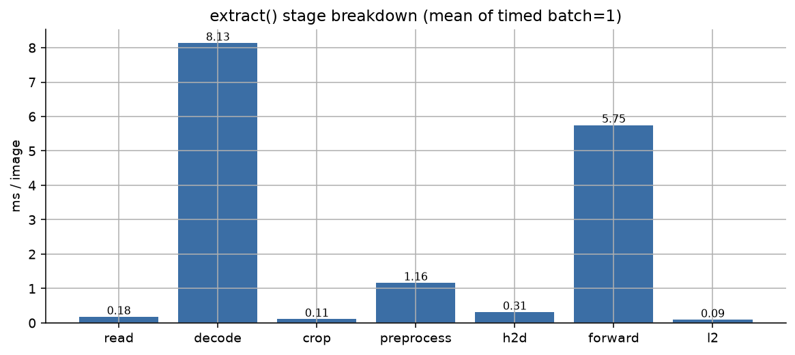

*Batch-1 diagnostic after contest warmup. Decode (~8.1 ms) now dominates; compiled forward is
~5.7 ms. Extra per-stage CUDA syncs mean the bars do not sum to `latency_b1`.*

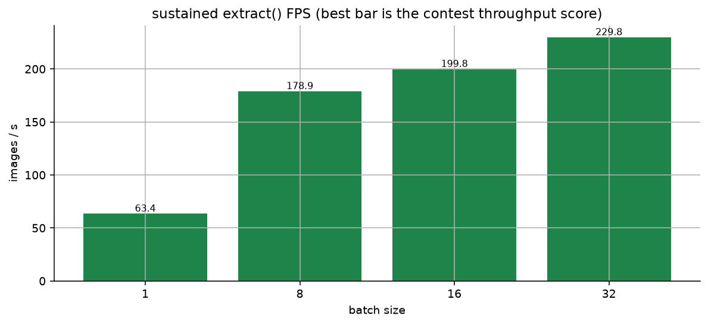

*Best bar is the contest throughput score. Batch 32 is 229.8 FPS on this H200.*

The contest payload is `weights/finetuned/eva02.pt` (EMA tensors plus the saved Hydra cfg). A
training Lightning `.ckpt` is not submitted: export it with `scripts/export_serving.py`. Contest
A5000 numbers will be slower than this H200; the same kernels still apply.

## Open-set refusal

The closed test set is an unmarked open-set probe: about 20% of queries have no corresponding
vehicle in the gallery, and those queries are not flagged in any released file. The remaining 80%
are guaranteed at least one cross-camera positive. Local **training** still uses 50/50 pairs (full
gallery vs that identity stripped). Local **calibration and evaluation** copy the contest mix:
`open_set_pack` holds out 20% of query identities from the gallery, one row per query (~20% open).
F1, TNR, and the contest operating point are fit and reported only on those eval packs. Nested
5-fold inner CV trains CatBoost/TabM on four folds' 50/50 packs, freezes thresholds on the inner
eval packs, then scores the held fold's eval pack.

Contest **F1 and TNR are micro**, not macro: one confusion matrix over the whole query set
(TP/FP/FN/TN summed, then F1/TNR from those totals). There is no per-query or per-identity
average. Both metrics are computed only from `candidates.csv`. `submission.csv` is ignored for
F1/TNR.

Contest F1 is query-level: TP only if the query has a gallery match **and** the highest-confidence
candidate is that identity. Extra candidates below that top row do not change F1 or TNR. Wrong
top-1 on a closed query is FP, not TP. TNR uses only queries with no gallery match. The contest
operating-point score is `0.7 × F1 + 0.3 × TNR`. PR-AUC remains a threshold-free ranking of match vs
no-match queries.

The operating points in `configs/refusal/` maximize the contest score `0.7 × F1 + 0.3 × TNR` on
nested 5-fold inner CV of the labeled-only trial23 eval packs (cosine 0.6638, CatBoost 0.5540). They
are the team's accept/refuse rule for forming `candidates.csv`. Organizers do not re-apply them, and
`confidence` is not required to be a calibrated probability. Outer-OOF metrics concatenate each
fold's accept/refuse mask from that fold's inner-CV threshold; they do not re-apply the mean serving
threshold to the evaluated queries.

Outer-OOF on the 20% identity-hold-out packs (one confusion matrix over concatenated per-fold
decisions; 310 open / 1231 closed queries):

| Head | contest | F1 | TNR | PR-AUC |
| --- | ---: | ---: | ---: | ---: |
| Cosine (serving) | 0.825 | 0.823 | 0.829 | 0.967 |
| CatBoost | 0.817 | 0.809 | 0.835 | 0.961 |
| cosine AND CatBoost | 0.821 | 0.806 | 0.855 | 0.965 |

Cosine alone wins the contest score, so Docker serving is `eva02_threshold` (max cosine ≥ 0.6638).
That gap is small. Identity-bootstrap 95% CIs on the same outer-OOF decisions: cosine contest
**0.825 [0.805, 0.843]**, CatBoost **0.817 [0.797, 0.835]**, AND **0.821 [0.801, 0.839]**. The paired
cosine−CatBoost delta is **+0.008 [−0.002, +0.018] and includes 0**. Cosine is the serving head
because it is simpler and not worse, not because the difference is significant. CatBoost and the
two-head AND stay as optional presets (`eva02_model`, `eva02_ensemble`). Rank-average / TabM remain
OOF calibration only.

Eight fixed 20% identity-hold-out seeds `{0..7}` on every fold: re-fit cosine cuts average 0.653
(std 0.038). The frozen serving cut 0.6638 scores contest 0.823 mean (std 0.018). After holding out
open identities, subsample the remaining gallery to 750 (test size, keep at least one positive):
frozen-cut contest 0.821 vs 0.825 on the full val gallery. Lookalike queries are the weak slice
(contest 0.750, TNR 0.694 at the serving cut). Nested inner-CV does not undo HPO leakage on the
embeddings. OOF F1/TNR calibrate the rule on fold extractors; transferring that threshold onto the
full-retrain serving checkpoint is a practical choice, not a measurement of that checkpoint on new
identities.

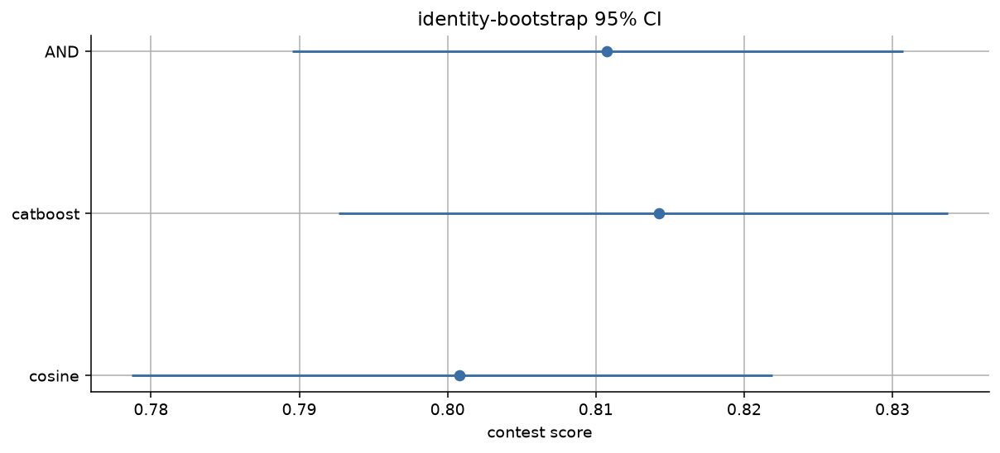

*2000 identity resamples of nested outer-OOF accept/refuse masks. Cosine and CatBoost CIs overlap.
Notebook: `notebooks/eva02/refusal_analysis.ipynb`.*

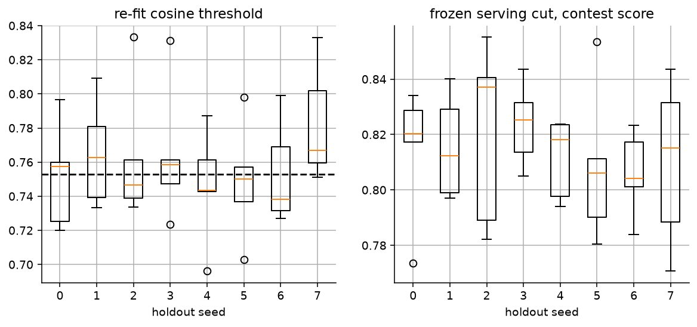

*Left: re-fit cosine threshold on eight fixed hold-out seeds. Dashed line is the serving cut
0.6638. Right: contest score of that frozen cut. Notebook:
`notebooks/eva02/refusal_analysis.ipynb`.*

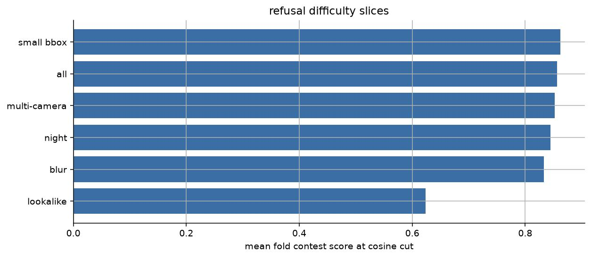

*Frozen serving cosine cut on nested eval packs. Lookalikes (impostor cosine ≥ 0.55) lose TNR.
Notebook: `notebooks/eva02/refusal_analysis.ipynb`.*

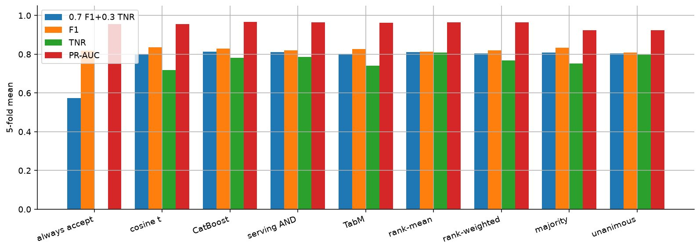

*Nested 5-fold inner CV on labeled-only trial23 OOF, 20% identity-hold-out eval packs. Contest
score is `0.7 × F1 + 0.3 × TNR`. “Always accept” has no TNR. Serving is cosine 0.6638.
CatBoost 0.5540 is kept as an optional head. The AND row is not the Docker rule.*

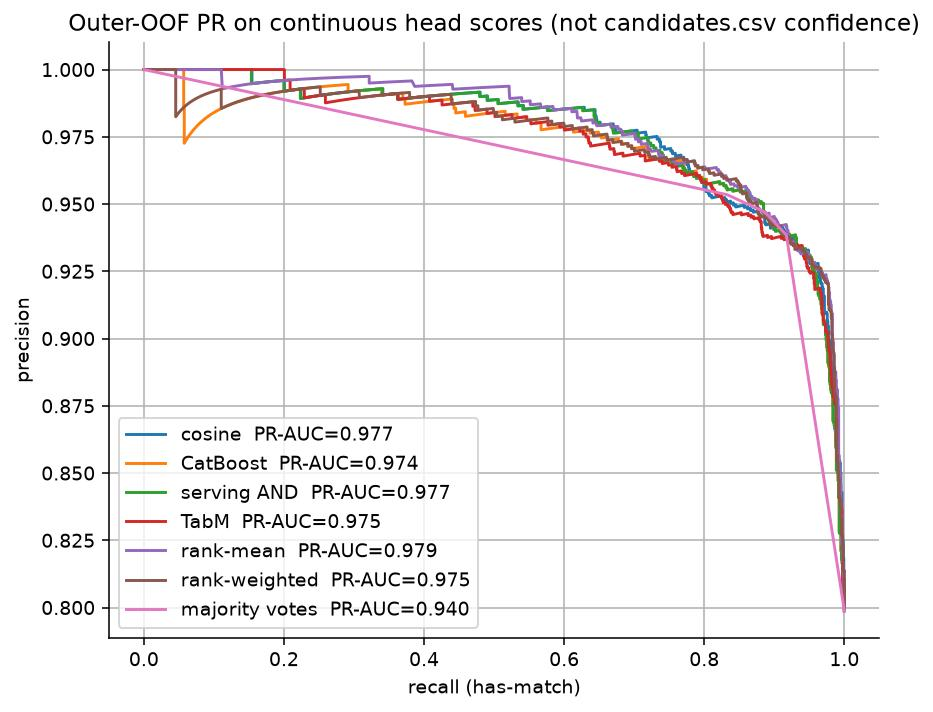

*Threshold-free ranking of “does a gallery match exist?” on labeled-only trial23 nested OOF. PR-AUC:
cosine 0.967, CatBoost 0.961. Notebook: `notebooks/eva02/refusal_analysis.ipynb`.*

The 0.6638 cut is not ArcFace `m` or AdaSP `τ` read off the loss. Trial23 trains ArcFace
(`m = 0.479` rad ≈ 27.4°, `s = 35.1`) plus AdaSP (`τ = 0.026`, `1/τ ≈ 38.4`) on a PK 16×2 batch.
AdaSP with `K=2` has one positive pair per identity and ~30 in-batch negatives; it sets a *relative*
gap, not an absolute cosine. On the 20% identity-hold-out OOF packs that gap is large: median
true-match max cosine 0.780 vs median open/impostor max 0.532 (mean gap 0.197 ≈ 8`τ`). Gallery
max-impostor is an extreme value over ~870 crops, so it cannot be equated to the in-batch hard
negative. The contest operating point sits at the midpoint of those two max-cosine distributions
(median midpoint 0.656, mean midpoint 0.654, nested cut 0.664). ArcFace’s class-center margin
`cos(θ+m)` is a classification logit, not a pairwise retrieval threshold: mean cross-camera intra
cosine is 0.690 (`√E[intra] ≈ 0.83`, about 34° from a hypothetical center), which is near the cut
only because the cut is also near typical intra cosine, not because `m` algebraically equals 0.66.

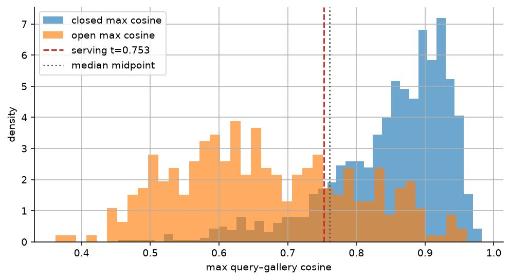

*20% identity-hold-out OOF. Closed max-cosine median 0.780, open 0.532; serving cut 0.664 is the
midpoint. Notebook: `notebooks/eva02/refusal_analysis.ipynb`.*

`refusal/` implements three accept/refuse heads on top of frozen retrieval embeddings, plus
ensembles of those heads. None of them uses `camera_id` or `vehicle_id` as a feature; those labels
exist only while building the training pairs.

1. **Cosine threshold (serving).** Score is the maximum query-gallery cosine. The operating point
   maximizes `0.7 × F1 + 0.3 × TNR` on inner-CV eval packs, never on the reported fold. Docker uses
   this head.
2. **CatBoost.** A binary classifier on the retrieved set. Training examples are balanced 50/50 by
   scoring the same query against the full gallery (`y=1`) and against the gallery with that
   identity removed (`y=0`). The contest operating point is **not** chosen on those pairs: it is
   frozen on 20% identity-hold-out eval packs (`open_set_pack`). Features are similarity statistics,
   pairwise/graph descriptors of the top-k neighbors, and the concatenated query and top-1 gallery
   embeddings.
3. **TabM.** A parameter-efficient MLP ensemble after Gorishniy et al., ICLR 2025: shared linear
   weights, BatchEnsemble rank-1 input/output scales, `k` member logits trained jointly, mean
   sigmoid at inference, and train-set feature standardization.
4. **Ensembles.** Rank-average, three-head votes, and cosine AND CatBoost are **OOF calibration
   only** (ranks use the query batch). `eva02_ensemble` remains a streaming-safe AND preset if
   someone wants both heads; it is not the Docker default.

`eval.py` selects a frozen submit head with `refusal=` (`none`, `eva02_threshold`, `eva02_model`,
`eva02_ensemble`). Serving thresholds and the CatBoost path live in `configs/refusal/`. Default
local `none` writes every query; the Docker image uses `eva02_threshold`. The mask is applied to
`candidates.csv` only. Each head scores one query against the gallery; serving does not
rank-average across the test query batch.

`notebooks/eva02/refusal_analysis.ipynb` compares the heads and ensembles on EVA02 5-fold OOF.
`notebooks/eva02/inference_profile.ipynb` measures the contest extract() cycle (15.9 ms / 230 FPS / 0.200 on isolated H200).

## Pretrained weights and offline use

Download supported external weights on a machine with Hugging Face access:

```bash
.venv/bin/python scripts/download_weights.py dinov3_base
.venv/bin/python scripts/download_weights.py dinov3_large
.venv/bin/python scripts/download_weights.py radio
.venv/bin/python scripts/download_weights.py llm2clip
.venv/bin/python scripts/download_weights.py efficientloftr
```

Copy the resulting `weights/` directory to the training machine and set the corresponding
`model.checkpoint_path`. Use `model.local_files_only=true` where supported to prevent network
access. Each download is pinned by file SHA-256 (and a Hub commit for RADIO and LLM2CLIP). A
checksum mismatch after download is an error.

Contest serving weights are not these Hub snapshots. Export EMA tensors from a Lightning training
checkpoint into a compact `.pt`, fit CatBoost on that checkpoint's embeddings (`--full-retrain`) or
on 5-fold OOF packs, then record checksums:

```bash
.venv/bin/python scripts/export_serving.py \
  --checkpoint runs/full/eva02_trial23/checkpoints/last.ckpt \
  --output weights/finetuned/eva02.pt \
  --weights ema \
  --sha256
.venv/bin/python scripts/export_refusal.py \
  --nested \
  --cv runs/cv/eva02_trial23 \
  --update-config
.venv/bin/python scripts/export_refusal.py \
  --full-retrain \
  --cv runs/cv/eva02_trial23 \
  --checkpoint runs/full/eva02_trial23/checkpoints/last.ckpt \
  --device cuda:2 \
  --output weights/finetuned/eva02_catboost.cbm \
  --sha256
```

`--checkpoint` for the embedding `.pt` defaults to `last_checkpoint` in
`runs/full/eva02_trial23/run_summary.json` when that
file exists, otherwise the path in `runs/cv/eva02_trial23/fold0/val/metrics.json`. The serving `.pt`
is `format=reid-serving`: Hydra `cfg`, ReIDModel `state_dict`, and the exported weight kind.
Optimizer, loops, and the unused raw copy are dropped so the file stays under the
2 GiB contest cap. `--nested` writes the mean inner-CV cosine and CatBoost thresholds into
`configs/refusal/` (currently 0.6638 / 0.5540), selected on 20% identity-hold-out eval packs.
`--update-config` is valid only with `--nested`.
Without `--full-retrain`, CatBoost is fit on the five fold-OOF embedding packs. With `--full-retrain`,
those same query/gallery CSVs are re-embedded by the serving checkpoint through `embed_frame` (the
same context-TTA average as `eval.py`) so the head matches the contest `.pt`. Both use the recipe in
`notebooks/eva02/refusal_analysis.ipynb` (`iterations=200`, `depth=4`, embeddings in the feature
vector). `--sha256` rewrites `weights/finetuned/SHA256SUMS`. `.cbm` is outside the official 2 GiB
suffix glob.

```text
weights/finetuned/
├── SHA256SUMS
├── eva02.pt
└── eva02_catboost.cbm
```

`eva02.pt` is the eval/Docker checkpoint. `eva02_catboost.cbm` is only required for
`refusal=eva02_model` and `refusal=eva02_ensemble`. Nested inner-CV accept
thresholds (`0.6638` cosine, `0.5540` CatBoost) live in `configs/refusal/`; Docker uses the cosine
cut. `--full-retrain` does not retune them.

Those binaries are Git LFS objects (see `.gitattributes`). After adding or replacing them without
`--sha256` on the exporter:

```bash
.venv/bin/python scripts/verify_weights.py --root weights/finetuned --write
```

`SHA256SUMS` stays a plain-text file. An empty checksum file is valid only while the directory has
no payload files; the Docker build verifies the tree.

## Contest Docker image

The image may use the network during `docker build`. `docker run` is fully offline:
`HF_HUB_OFFLINE=1`, `TRANSFORMERS_OFFLINE=1`, and Compose `network_mode: none`. GPU access is
`--gpus all` (Compose `gpus: all`). Python packages are
installed from `requirements/runtime.txt` with `pip install --require-hashes` on public PyPI. That
file is the frozen export of `uv.lock`; regenerate it with `make lock`. The lab `uv.lock` registry
URL is not used at image build time.

The serving `.pt` is copied into the image from `weights/finetuned/`. Do not mount a host
`weights/` directory over `/app/weights`, or the baked files are hidden. Mount only contest data and
the output directory:

```bash
docker compose build
DATA_ROOT=./data OUTPUT_DIR=./runs/submission docker compose run --rm retrieval
```

Equivalent:

```bash
docker run --gpus all --network none \
  -v "$PWD/data:/data:ro" \
  -v "$PWD/runs/submission:/runs/submission" \
  retrieval
```

One command writes `submission.csv`, `embeddings.npy`, and `candidates.csv` from the mounted
`images/` plus query/gallery CSV. The default command is:

```text
checkpoint=/app/weights/finetuned/eva02.pt
data.root=/data
eval.split=test
eval.output_dir=/runs/submission
eval.top_k=10
refusal=eva02_threshold
```

Override `CHECKPOINT` or pass extra Hydra flags after `retrieval`. Eval loads
`ReIDModel(..., initialize_pretrained=False)`, so Hub/timm pretrained weights are not fetched at
inference. SDPA + `torch.compile` are enabled for llm2clip even when the Hydra default model is
ConvNeXt: kernel flags overlay only if `model.backend` matches the checkpoint. The first
forward pays compile (~45 s on H200); later batches use the compiled graph.
`extra_data/`, tests, notebooks, and training runs are not copied into the image.

## Cross-validation

Run all five `dino_base` folds in parallel. The first argument is the five physical GPU IDs, one
per fold:

```bash
EXPERIMENT=dino_base scripts/train_folds.sh 3,4,5,6,7
```

Each process sees one GPU through `CUDA_VISIBLE_DEVICES` and runs with `trainer.devices=1`. Existing
Hugging Face weights are loaded from `weights/dinov3_base/model.safetensors` with
`model.local_files_only=true`. Override the checkpoint through `MODEL_CHECKPOINT`. Additional Hydra
overrides can be appended after the GPU list:

```bash
RUN_ROOT=runs/cv/dino_base_v1 \
MODEL_CHECKPOINT=/models/dinov3_base/model.safetensors \
scripts/train_folds.sh 3,4,5,6,7 \
  data.root=/datasets/vehicle-reid \
  train.epochs=30
```

After every fold finishes, the runner evaluates its best checkpoint on the complete held-out fold,
prints aggregate retrieval metrics, and writes:

- `cv_metrics.json`: mean, standard deviation, and query-weighted mean across folds.
- `oof_embeddings.npy`: normalized embeddings for every training image exactly once.
- `oof.csv`: labels, fold assignments, source rows, and embedding indices.
- `foldN/run_summary.json`: best and last checkpoint paths.
- `foldN/val/metrics.json`: retrieval metrics for one fold.
- Per-fold training and evaluation logs.

To aggregate already completed fold metrics manually:

```bash
.venv/bin/python scripts/aggregate_cv.py \
  runs/fold0/metrics.json \
  runs/fold1/metrics.json \
  runs/fold2/metrics.json \
  --output artifacts/cv_summary.json
```

The report contains per-metric mean, standard deviation, and query-weighted mean. Duplicate fold
IDs are rejected. Embeddings from independently trained folds are not directly comparable and are
therefore not merged by this utility.

## Hyperparameter optimization

The Optuna search runner trains all five folds concurrently, evaluates every best checkpoint, and
maximizes the query-weighted OOF retrieval metric. `--metric` selects both the OOF objective and
the Lightning `checkpointing.monitor` (`val/{metric}`), so `--metric=mAP@10` keeps checkpoint
selection aligned with the contest ranking metric. An explicit `--override checkpointing.monitor=`
is left in place. Pass five GPU IDs with `--gpus`; there is no default assignment:

```bash
.venv/bin/python -m hpo.run_optuna_search \
  --model dinov3_convnext_large \
  --checkpoint weights/dinov3_large/model.safetensors \
  --gpus 3,4,5,6,7 \
  --study-name convnext_large_all \
  --n-trials 200
```

Research of non-streaming methods uses a different study name:

```bash
.venv/bin/python -m hpo.run_optuna_search \
  --model dinov3_convnext_large \
  --checkpoint weights/dinov3_large/model.safetensors \
  --gpus 3,4,5,6,7 \
  --space nonstreaming \
  --study-name convnext_large_nonstreaming \
  --n-trials 200
```

`hpo/optuna_search_space.py` defines two search spaces. `--space contest` is the default and the
only serving-legal search: it forces `postproc.streaming=true`, never enables AQE, and still samples
gallery aggregation plus per-query k-reciprocal/GNN rerank. `--space nonstreaming` is a separate
research mode that forces `postproc.streaming=false` and samples AQE. Contest and nonstreaming
trials must not share a `--study-name`. Both spaces sample input size and crop context, P×K
sampling, backbone optimization controls, pooling, head, every supported loss and its parameters,
optimizer, scheduler, regularization, every augmentation transform and parameter, and TTA. The
selected model architecture, checkpoint, five-fold protocol, data paths, fold assignment, worker
and loader settings, precision, deterministic mode, logging, checkpoint `save_top_k` / `save_last`,
metric protocol, and output paths stay fixed so trials remain comparable and operational settings do
not consume search trials. `checkpointing.monitor` follows `--metric` unless `--override` sets it.

Pass data or environment-specific Hydra settings with repeatable `--override` flags:

```bash
.venv/bin/python -m hpo.run_optuna_search \
  --model dinov3_convnext_large \
  --checkpoint /models/dinov3_large/model.safetensors \
  --study-name convnext_large_all \
  --override data.root=/datasets/vehicle-reid \
  --override data.train_csv=/datasets/vehicle-reid/train.csv \
  --override data.image_dir=/datasets/vehicle-reid/images
```

The study is persisted in `artifacts/optuna/<study-name>.db`. Repeating the command with the same
study name and storage resumes it and runs only the missing trials. Interrupted `RUNNING` trials are
marked failed, CUDA OOM trials are pruned, other fold failures are recorded without terminating the
study, and child processes are terminated on interruption. Each trial stores sampled parameters,
exact Hydra overrides, fold logs, exit codes, metrics, OOF metadata, and OOF embeddings. `best.json`
always identifies the best completed trial.

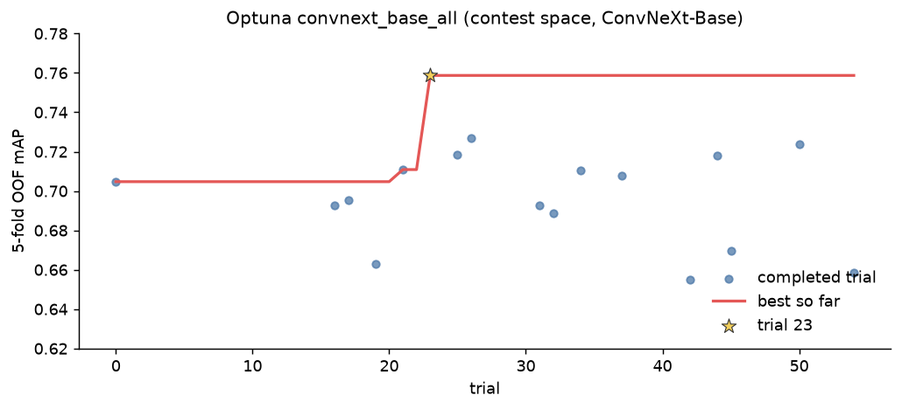

*`convnext_base_all`, contest space, query-weighted 5-fold OOF mAP. Trial 0 is the seeded DINOv3
ConvNeXt-Base run (~0.705). Trial 23 is the best completed trial (0.759). That recipe — not the
ConvNeXt weights — is what `current_best_tuned` applies to EVA02-L-14-336, where labeled-only OOF
mAP is 0.847. HDBSCAN test pseudo-labels were tried and are not used. Later trials did not
beat 23. Live view: Optuna Dashboard on the same SQLite file.*

Seed a new study with the completed DINOv3 ConvNeXt Base run. Its configuration and query-weighted
OOF mAP are registered as the first completed Optuna trial without retraining:

```bash
.venv/bin/python -m hpo.run_optuna_search \
  --model dinov3_convnext_base \
  --checkpoint weights/dinov3_base/model.safetensors \
  --gpus 3,4,5,6,7 \
  --study-name convnext_base_all \
  --seed-run runs/cv/dino_base_first \
  --n-trials 200
```

Every trial uses the complete dataset epoch with `data.sampler.steps_per_epoch=null`, and gradient
checkpointing is always disabled. Runtime errors, non-finite runs, and OOM configurations are
recorded as pruned trials instead of failed trials, allowing the study to continue. Fold workers
stop immediately when one fold exits unsuccessfully.

### Optuna Dashboard

Use the local dashboard to monitor the running study, compare completed trials, inspect sampled
parameters, and analyze parameter importance:

```bash
.venv/bin/optuna-dashboard \
  sqlite:///artifacts/optuna/convnext_base_all.db
```

Use `artifacts/optuna/<study-name>.db` for the study you actually started. The file is created by
`hpo.run_optuna_search`; the dashboard will not initialize schema. Pointing it at a missing path
creates an empty SQLite file and then fails with `no such table: version_info`.

The dashboard is available at `http://127.0.0.1:8080`. For a remote machine, either forward port
8080 over SSH or expose the service on the machine's network interface:

```bash
.venv/bin/optuna-dashboard \
  --host 0.0.0.0 \
  --port 8080 \
  sqlite:///artifacts/optuna/convnext_base_all.db
```

The dashboard can safely read the SQLite study while the search runner is writing new trials.
Per-epoch fold metrics remain available in
`artifacts/optuna/<study-name>/trial_<number>/fold<fold>/logs/version_0/metrics.csv`.

## Quality gates

Format first-party code, then run Ruff and ty:

```bash
make lint
```

The equivalent commands are:

```bash
.venv/bin/ruff format .
.venv/bin/ruff check .
.venv/bin/ty check
```

Run tests:

```bash
make test
```

The default pytest command enforces 100% line coverage over all first-party runtime code. Tests use
synthetic data and mocks for network, GPU-only, and large-model operations.

Ruff and ty check first-party source, tests, and notebooks. Vendored code under `third_party/` is
the only code exclusion. Function-local imports are forbidden by Ruff rule `PLC0415`. The `dev`
extra includes `matplotlib` and `IPython` so notebook cells type-check and rerun in the same
environment as `make lint`.

## Reproducibility and safety

- Python and core ML dependency versions are pinned exactly in `pyproject.toml`, `uv.lock`, and
  hashed `requirements/runtime.txt`.
- Finetuned serving weights under `weights/finetuned/` are Git LFS objects with `SHA256SUMS`.
- Fold generation is deterministic for a fixed annotation file, seed, and fold count.
- Data fingerprints are persisted and checked when folds or checkpoints are reused.
- Validation identities are disjoint from training identities.
- Partial validation runs are treated as smoke checks and do not report retrieval scores.
- Non-finite embeddings, losses, and reranking results fail explicitly.
- Model adapters validate returned feature count, shape, and configured dimensions.

## Project layout

```text
augmentations/  Config-driven image augmentation pipeline
configs/        Hydra model, loss, optimizer, scheduler, refusal, and experiment presets
dataset/        Annotation validation, folds, datasets, data module, pretrain loaders, and samplers
extra_data/     Optional external identity-labeled crops for pretraining
models/         Backbone adapters, pooling, embedding model, and inference kernels (SDPA / compile)
modules/        Lightning module, losses, metrics, inference, optimization, and regularization
interp/         Embedding attribution: cosine Grad-Sim, Grad-Attention rollout, patch occlusion, CAM, Chefer
matching/       EfficientLoFTR pair matching, homography inliers, cosine top-k rerank
notebooks/      EDA plus EVA02 OOF, labeled-vs-mcs4 experiment compare, interp, matching, posthoc, refusal, inference profile; `eva02/readme_figs/` is the README image set
posthoc/        Query-corruption robustness: embedding cosine, neighbor overlap, AP shift
postproc/       Retrieval expansion, aggregation, and reranking
profiling/      Contest extract() timing, weight inventory vs 2 GiB, VRAM, determinism
refusal/        Open-set accept/refuse: cosine threshold, CatBoost, TabM, eval-time mask, contest 0.7 F1 + 0.3 TNR
requirements/   Hashed pip freeze used by the contest Docker image
scripts/        Dataset audit, fold creation, weight download, serving `.pt` / CatBoost export, checksum verification, model checks, zero-shot probes, CV aggregation, and HDBSCAN pseudo-labeling
tests/          CPU/offline unit, integration, configuration, and entrypoint tests
third_party/    Vendored upstream implementations
weights/        Local Hub snapshots (gitignored) and `finetuned/` serving artifacts (Git LFS)
Dockerfile      Offline contest serving image
pretrain.py     Hydra pretraining entrypoint on extra data
train.py        Hydra training entrypoint
eval.py         Serving `.pt` / Lightning checkpoint evaluation and retrieval entrypoint
```